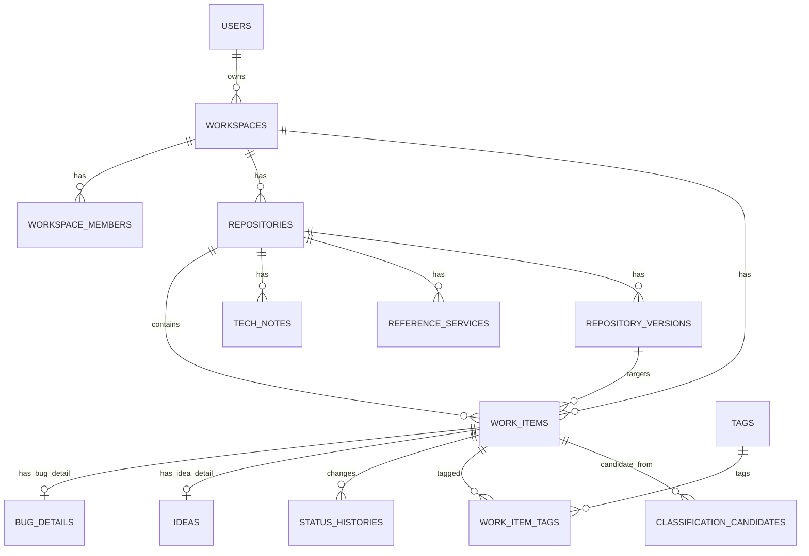
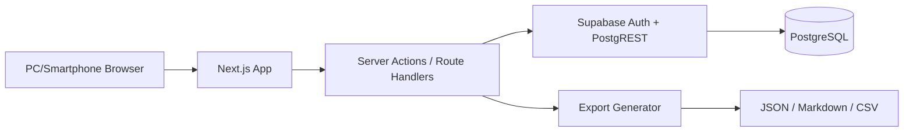

# NextPatch ローカルサーバー版 統合設計・詳細作業計画書

作成日: 2026-04-20  
対象: NextPatch MVP / ローカルサーバー版  
前提: 空リポジトリに展開して、以後の実装計画・Codex 作業指示の正本として使う。

---

# 1. エグゼクティブサマリー

NextPatch は、開発中アプリや GitHub リポジトリごとに、課題、進捗、バグ、実装予定、将来構想、採用技術、参考サービス、新規アイデア、ChatGPT との壁打ちメモを整理し、**「今やるべきこと」を理由付きで即座に把握するための Repo Action Hub** として作る。

MVP はクラウド SaaS ではなく、**ローカルサーバーで動く自己管理型 Web アプリ**として作る。個人開発者が自分の PC、LAN 内サーバー、自宅サーバーで起動し、PC では整理・判断、スマホではクイック登録・確認・状態更新を行える状態を目標にする。

MVP の完成条件は、GitHub API や OpenAI API が未接続でも、以下が成立すること。

1. 複数リポジトリを登録できる。
2. リポジトリごとにタスク、バグ、アイデア、実装予定、将来構想、技術メモ、参考サービス、未整理メモを保存できる。
3. 未整理メモを分類して WorkItem 化できる。
4. ダッシュボードで「今やるべきこと」「重大バグ」「未整理メモ」「最近完了」が見える。
5. JSON エクスポートにより自分のデータを退避できる。
6. `docker compose up -d` または `supabase start` + `pnpm dev` でローカル起動できる。

---

# 2. 最終決定事項一覧

| 領域 | 最終決定 | 理由 | MVP対象 | 備考 |
|---|---|---|---|---|
| プロダクト方針 | Repo Action Hub として作る | GitHub Projects や汎用 TODO の再実装を避け、開発判断と次アクションに集中する | ○ | 「記録」より「判断」を重視 |
| MVP範囲 | Repository / WorkItem / Inbox / Dashboard / Quick Capture / Export | 連携より手動整理の価値検証を優先する | ○ | GitHub/AI は手動入口まで |
| 非スコープ | SaaS公開、チーム共有、GitHub同期、AI自動分類、添付ファイル | 認証・同期・権限・費用・運用が膨らむ | ○ | P1/P2 に回す |
| 端末方針 | PCは整理・判断、スマホは登録・確認・状態更新 | 端末ごとの利用時間と入力負荷が違う | ○ | スマホに大量整理を押し込まない |
| 実行方式 | ローカルサーバー / LAN 内サーバー / 自宅サーバー | ユーザー希望によりクラウド前提から変更 | ○ | README に起動手順必須 |
| データ保存方式 | Supabase Local/Self-hosted + PostgreSQL | RDB、Auth、RLS、migration をまとめて扱える | ○ | local stack と self-host を分ける |
| 認証 | Supabase Auth を利用し、ローカルでも認証必須 | 未公開構想・バグ・技術判断を保存するため | ○ | 認証なし標準モードは作らない |
| データモデル | WorkItem 共通モデル + 型別詳細テーブル | 横断一覧と型固有情報を両立する | ○ | `repositoryId` nullable |
| 状態定義 | 種別別表示状態 + 共通 lifecycle 判定 | 自然な状態名と横断ダッシュボードを両立する | ○ | open/closed/completed/archived |
| ダッシュボードロジック | 説明可能な tier ルール | AI なしでも理由を表示できる | ○ | スコアリングは将来 |
| GitHub連携 | MVP は Level 1: URL解析まで | OAuth/token/sync を避けつつ将来連携の土台を作る | ○ | API 呼び出しなし |
| ChatGPT連携 | MVP は手動貼り付け + 未整理メモ + JSON/Markdown 解析 | 原文を失わず、AI送信リスクを避ける | ○ | API分類は後回し |
| バックアップ | JSON export を唯一の可逆バックアップ形式にする | ローカル運用でデータ喪失対策が重要 | ○ | Markdown/CSV は補助 |
| UI方針 | DADS 参照ルール優先 | アクセシビリティ、一貫性、重要情報の露出を担保する | ○ | 未整備部品は NextPatch暫定ルール |
| テスト方針 | 単体/結合/E2E/a11y/レスポンシブ/復元を品質ゲート化 | ローカル運用でもデータ破壊・権限漏れを避ける | ○ | Playwright + axe 想定 |

---

# 3. MVPスコープ定義

## MVPに必ず含める機能

| 機能 | 内容 |
|---|---|
| ローカル実行基盤 | `pnpm dev` + `supabase start`、および常用 `docker compose up -d` 前提の構成 |
| 認証 | Supabase Auth。メール OTP / magic link を基本にする |
| Repository CRUD | 手動リポジトリ登録、GitHub URL 解析、アーカイブ |
| WorkItem CRUD | task / bug / idea / implementation / future_feature / memo を登録・編集 |
| バグ詳細 | severity、再現手順、期待結果、実際結果、環境、修正日時 |
| アイデア詳細 | 価値仮説、対象ユーザー、実現性、採用判断 |
| 技術メモ | 採用済み、候補、評価中、却下、廃止を記録 |
| 参考サービス | サービス名、URL、参考ポイント、良い点、懸念点 |
| 未整理メモ | repo 未確定でも保存可能。ChatGPT 貼り付け原文を保持 |
| 未整理メモ分類 | memo から task / bug / idea / tech / reference へ変換 |
| 状態変更 | タスク完了、バグ修正済み、アイデア採用済み等 |
| ダッシュボード | 今やるべき、重大バグ、次バージョン対象、未整理メモ、最近完了 |
| 検索・絞り込み | repository、type、status、priority、tag、未紐づけ |
| JSON export | 復元可能な正本バックアップ |
| Markdown/CSV export | 読み物・棚卸し用の補助出力 |
| DADS準拠UI | ラベル、サポートテキスト、具体エラー、ボトムナビ非採用 |
| テスト | 状態遷移、権限、export、responsive、a11y の最低限 |

## MVPでは簡易実装にする機能

| 機能 | 簡易実装内容 |
|---|---|
| GitHub連携 | URL解析、owner/repo 抽出、Issue/PR URL 手動リンクまで |
| ChatGPT連携 | 標準プロンプト、手動貼り付け、JSON/Markdown ローカル解析まで |
| PWA | manifest とアイコン程度。完全オフライン同期なし |
| システム設定 | `/settings/system` に runtime、DB/Auth状態、backup注意を表示 |
| 監査ログ | 主要操作の簡易 event 記録。詳細 UI は後回し |
| インポート | JSON 検証 + 新規 workspace 復元を基本。既存マージなし |

## MVPから外す機能

- SaaS 公開
- チーム共有 / RBAC UI
- GitHub OAuth / GitHub App / Issue 同期 / PR 同期 / Projects 連携
- OpenAI API 自動分類 / ChatGPT App / MCP / GPT Actions
- 添付ファイル管理
- カンバンのドラッグ&ドロップ
- 高度ロードマップ / ガント / 分析グラフ
- 通知・リマインダー
- 既存 workspace へのマージ復元
- ダークモード

## 将来拡張に回す機能

- GitHub read-only import
- GitHub Issue 作成
- 双方向同期
- AI 分類候補生成
- Codex 向け patch prompt 生成
- Obsidian/Markdown vault 連携
- Sentry 連携
- 複数ユーザー共有
- 暗号化 export

---

# 4. ユーザー像と利用シーン

| シーン | 主な利用者行動 | NextPatch の役割 | 端末方針 |
|---|---|---|---|
| PC利用 | 複数 repo の状況整理、優先度判断、メモ分類 | 横断ダッシュボードと詳細整理を提供 | PC 中心 |
| スマホ利用 | 思いつき登録、今日やること確認、完了/修正済み更新 | 3操作以内の登録と状態更新 | スマホ中心 |
| 開発中 | 実装中に出たバグ、TODO、設計判断を記録 | WorkItem と技術メモへ保存 | PC中心 |
| ChatGPT壁打ち中 | 会話結果を貼り付け、タスクやアイデアへ分類 | 原文保存と候補分類 | PC/スマホ両方 |
| 作業開始前 | 「今やるべきこと」を確認 | Now セクションで着手対象を提示 | PC/スマホ両方 |
| 振り返り | 最近完了、保留、未整理を確認 | 状態と履歴から次判断を促す | PC中心 |

最終判断として、**スマホはクイック登録中心、PCは整理・判断中心**という前提は妥当である。スマホに詳細分類や大量比較を詰め込むと入力負荷が上がるため、スマホでは「失わず保存」「今やる確認」「1操作で完了/修正済み」を優先する。

---

# 5. 情報設計・サイトマップ

## 画面一覧とルーティング

| 画面 | ルート | 目的 |
|---|---|---|
| ダッシュボード | `/` または `/dashboard` | 全 repo 横断で今やることを見る |
| リポジトリ一覧 | `/repositories` | 管理対象 repo を一覧する |
| リポジトリ詳細 | `/repositories/[repositoryId]` | repo 単位の状況・作業基地 |
| 横断WorkItem一覧 | `/work-items` | 全 item を検索・絞り込みする |
| アイデア一覧 | `/ideas` | idea / future_feature を横断確認する |
| 未整理メモ一覧 | `/inbox` | memo を分類する |
| クイック登録 | `/capture/new` | どこからでも情報を保存する |
| 技術メモ | `/tech-notes` | 採用技術・候補を管理する |
| 参考サービス | `/references` | 参考サービス・記事・競合を管理する |
| 設定 | `/settings` | アカウント、データ管理、システム状態 |
| データ管理 | `/settings/data` | export/import/backup |
| システム状態 | `/settings/system` | runtime, DB, Auth, export 状態 |

## ナビゲーション

PC は左サイドナビ + 上部 repo selector + クイック登録 CTA。  
スマホはヘッダー、クイック登録ボタン、ハンバーガーメニューを使い、ボトムナビゲーションは使わない。

---

# 6. 主要導線設計

| 目的 | 開始画面 | 操作1 | 操作2 | 操作3 | 達成条件 |
|---|---|---|---|---|---|
| 今やることを見る | ダッシュボード | 今やるべきセクションを見る | 必要ならカードを開く | — | 着手候補と理由が分かる |
| リポジトリ別に状況を見る | 任意 | repo selector を開く | 対象 repo を選ぶ | — | repo 詳細へ到達 |
| タスクを登録する | 任意 | クイック登録 | 種類 task と内容入力 | 保存 | WorkItem が作成される |
| タスクを完了する | ダッシュボード/詳細 | タスクカードの完了 | — | — | status done、completedAt 設定 |
| バグを登録する | 任意 | クイック登録 | 種類 bug と内容入力 | 保存 | bug detail 付き item 作成 |
| バグを修正済みにする | ダッシュボード/詳細 | バグカードの修正済み | — | — | status 解決済み/確認待ちへ遷移 |
| アイデアを登録する | 任意 | クイック登録 | 種類 idea と内容入力 | 保存 | idea item 作成 |
| 未整理メモを登録する | 任意 | クイック登録 | 本文入力 | 未整理メモとして保存 | repositoryId null でも保存 |
| 未整理メモを分類する | 未整理メモ一覧 | 分類する | 種類・repoを選ぶ | 保存 | 元メモ保持、分類先作成 |
| 採用候補を登録する | 技術メモ | 新規候補 | 技術名・理由入力 | 保存 | tech_note candidate 作成 |
| 参考サービスを登録する | 参考サービス | 新規登録 | URL・参考点入力 | 保存 | reference_service 作成 |

入力文字そのものは 1 操作に含める。完了や修正済みは確認モーダルを挟まず、成功バナーに「元に戻す」を出す。

---

# 7. 画面設計図

## ダッシュボード

- 目的: 全リポジトリ横断で「今やるべきこと」を把握する。
- 主な表示情報: 今やるべき、重大バグ、次バージョン対象、未整理メモ、最近完了、最近更新 repo。
- 主な操作: WorkItemを開く、完了/修正済みにする、クイック登録、repoへ移動。
- PCレイアウト: 左ナビ、中央に Now/重大バグ/未整理、右カラムに repo summary と system warning。
- スマホレイアウト: 1カラム。見出し、クイック登録、今やるべき、重大バグ、未整理メモの順。
- 空状態: 「まだリポジトリがありません。まずリポジトリを追加してください。」
- エラー状態: DB接続失敗、認証切れ、取得失敗をページ上部バナーで表示。
- DADS観点: 重要情報をアコーディオンに隠さない。プライマリーCTAはクイック登録。
- 関連データ: repositories, work_items, bug_details, status_histories.
- 受け入れ条件: 3操作以内に今やる対象へ到達でき、表示理由チップが見える。

## リポジトリ一覧

- 目的: 管理対象の repo を一覧し、状況を把握する。
- 主な表示情報: repo名、GitHub URL、状態、未完了数、重大バグ数、未整理メモ数、最終更新。
- 主な操作: 追加、詳細へ移動、アーカイブ、検索。
- PCレイアウト: テーブルまたはカードグリッド。比較項目は列で表示。
- スマホレイアウト: カードリスト。タイトル、状態、未完了数、重大バグを表示。
- 空状態: repo 追加 CTA。
- エラー状態: URL解析エラーはフォーム直下に具体表示。
- DADS観点: テーブルは構造化比較に使う。テーブルコントロールは暫定案。
- 関連データ: repositories.
- 受け入れ条件: GitHub URL から owner/repo を解析し保存できる。

## リポジトリ詳細

- 目的: repo 単位の作業基地。
- 主な表示情報: 現在の焦点、次アクション、未修正バグ、進行中、実装予定、アイデア、技術・参考、未整理メモ。
- 主な操作: WorkItem追加、状態更新、分類、技術メモ追加、参考サービス追加。
- PCレイアウト: メイン 8/9 カラム、右補助 3/4 カラム。
- スマホレイアウト: 1カラム。次アクション、重大バグ、クイック登録を上部表示。
- 空状態: 「このリポジトリにはまだ項目がありません。」
- エラー状態: repo が削除/アーカイブ済みの場合は状態説明と復元導線。
- DADS観点: タブで重要情報を隠さない。セクション見出しで縦積み。
- 関連データ: repositories, work_items, tech_notes, reference_services.
- 受け入れ条件: repo 文脈から 3操作以内に item 登録・完了・分類ができる。

## 横断WorkItem一覧

- 目的: 全 WorkItem を検索・絞り込みする。
- 主な表示情報: title, type, status, priority, repo, dueAt, completedAt.
- 主な操作: 検索、絞り込み、詳細表示、状態更新。
- PCレイアウト: 簡易フィルタ + テーブル。
- スマホレイアウト: カードリスト。
- 空状態: 絞り込み条件を解除する導線。
- エラー状態: 検索失敗はセクション内バナー。
- DADS観点: フィルタ UI はラベル付き。disabled で保存を止めない。
- 関連データ: work_items, tags.
- 受け入れ条件: repositoryId null の item も検索対象に含む。

## アイデア一覧

- 目的: idea / future_feature / implementation を横断して確認する。
- 主な表示情報: ideaStage, impact, confidence, effort, promotedWorkItemId.
- 主な操作: タスク化、採用、保留、却下。
- PCレイアウト: セクション型一覧。
- スマホレイアウト: カード中心。
- 空状態: アイデア追加 CTA。
- エラー状態: タスク化失敗は元アイデアを保持して通知。
- DADS観点: タスク化は破壊的変換にしない。元情報を保持。
- 関連データ: work_items, ideas.
- 受け入れ条件: idea から task を作って関連が残る。

## 未整理メモ一覧

- 目的: ChatGPTメモや思いつきを分類する処理待ちキュー。
- 主な表示情報: raw title, 作成日, 形式, repo候補, 分類状態, parse error.
- 主な操作: タスク化、バグ化、アイデア化、技術メモ化、参考サービス化、アーカイブ。
- PCレイアウト: メモカード + 分類アクションを表示。
- スマホレイアウト: 主要3操作を先出しし、その他は詳細ページへ。
- 空状態: 「未整理メモはありません。」
- エラー状態: JSON解析失敗でも保存済みとして表示し、修正方法を示す。
- DADS観点: 重要な分類操作をメニュー奥に隠さない。
- 関連データ: work_items(type=memo), classification_candidates.
- 受け入れ条件: 元メモを破壊せず分類先を作成できる。

## クイック登録

- 目的: 情報を失わず保存する。
- 主な表示情報: 関連repo、種類、タイトル、本文、機密度、今やるチェック。
- 主な操作: 保存、キャンセル、ChatGPTプロンプトコピー。
- PCレイアウト: 専用ページ。フォーム縦積み。
- スマホレイアウト: 1カラム。本文入力を主にする。
- 空状態: なし。
- エラー状態: 本文未入力時に「＊本文を入力してください。」
- DADS観点: placeholderに説明を依存しない。保存ボタンは安易に disabled にしない。
- 関連データ: work_items, repositories.
- 受け入れ条件: repo未選択でも memo として保存できる。

## 技術メモ

- 目的: 採用技術、候補、却下理由、廃止判断を残す。
- 主な表示情報: name, category, adoptionStatus, rationale, risks, officialUrl.
- 主な操作: 登録、採用決定、不採用、廃止、repo紐付け。
- PCレイアウト: 一覧 + 詳細。
- スマホレイアウト: カードリスト。
- 空状態: 技術メモ追加 CTA。
- エラー状態: 公式URL不正時に具体表示。
- DADS観点: 採用済み/候補/却下を色だけで表現しない。
- 関連データ: tech_notes.
- 受け入れ条件: candidate から adopted に状態変更できる。

## 参考サービス

- 目的: 参考サービス・競合・参考UI・記事を記録する。
- 主な表示情報: name, serviceType, url, referencePoint, good/bad points.
- 主な操作: 登録、アイデア化、採用候補化、アーカイブ。
- PCレイアウト: カード + フィルタ。
- スマホレイアウト: カードリスト。
- 空状態: 参考サービス追加 CTA。
- エラー状態: URL不正時に具体表示。
- DADS観点: 外部リンクは下線とアイコンで補助。
- 関連データ: reference_services.
- 受け入れ条件: URL と参考ポイントを保存できる。

## 設定

- 目的: アカウント、データ管理、システム状態を確認する。
- 主な表示情報: ユーザー、runtime mode、DB/Auth状態、export最終日時、backup注意。
- 主な操作: JSON export、Markdown export、CSV export、import検証、logout。
- PCレイアウト: セクション型。
- スマホレイアウト: 1カラム。
- 空状態: なし。
- エラー状態: export失敗、復元失敗をページ上部バナーで表示。
- DADS観点: 機密情報警告は折りたたまない。物理削除はページ内確認パネル。
- 関連データ: export_logs, import_jobs, system status.
- 受け入れ条件: 3操作以内でJSON exportに到達できる。

---

# 8. UIスタイルガイド案

DADS 参照ルールを NextPatch 用に落とし込む。DADS 未整備項目は `NextPatch暫定ルール` として扱う。

| 項目 | NextPatch ルール |
|---|---|
| カラー | Primary は青系。背景はニュートラル。成功/エラー/警告/情報は意味を保つ。状態は色だけで伝えない |
| タイポグラフィ | 本文 16px 以上。H1 32px、H2 24px、H3 20px、本文 16px、メタ 14px は制約時のみ |
| 余白 | 8px 基準。8/16/24/40/64 の5段階。セクション間は広く、カード内は16〜24 |
| 角丸 | none 0、sm 4、md 8、lg 12、full 9999 |
| エレベーション | 原則フラット。重なりが必要な要素のみ。シャドウだけに頼らずボーダー併用 |
| アイコン | 意味補助に限定。状態はテキストと併用 |
| ボタン | Primary/Secondary/Tertiary/Destructive。Primary は原則1画面1個。44px以上の押下領域 |
| フォーム | 可視ラベル、要否、サポートテキスト、具体エラー。placeholder説明は禁止。disabled 原則回避 |
| テーブル | PC の構造化一覧に使用。スマホはカード。高度テーブルコントロールは暫定案 |
| カード | スマホの一覧、ダッシュボード項目に使用。タイトル、状態、次操作を明示 |
| 通知 | ページ上部または対象セクション内のバナー。成功/エラー/警告/情報を分ける |
| ナビゲーション | PC は左ナビ。スマホはハンバーガーメニュー。ボトムナビは使わない |
| レスポンシブ | 768px 未満をモバイル/タブレット、768px 以上をデスクトップ |
| アクセシビリティ | WCAG 2.2 AA 相当を目標。キーボード操作、フォーカス、コントラスト、ラベル必須 |
| 禁止または原則回避するUI | ボトムナビ、重要情報のアコーディオン隠し、placeholder頼み、disabled頼み、多段メニュー、複雑モーダル、タブ依存 |

---

# 9. データモデル設計

## エンティティ一覧

| エンティティ | 役割 | MVP |
|---|---|---|
| users/profiles | Supabase Auth のユーザー参照 | ○ |
| workspaces | 個人 workspace。将来チーム化 | ○ |
| workspace_members | MVP は本人のみ。RLS基準 | ○ |
| repositories | GitHub repo または開発中アプリ | ○ |
| work_items | タスク、バグ、アイデア、実装予定、将来機能、未整理メモの共通本体 | ○ |
| bug_details | バグ固有情報 | ○ |
| ideas | アイデア固有情報 | ○ |
| tech_notes | 採用技術・候補技術 | ○ |
| reference_services | 参考サービス・記事・競合 | ○ |
| tags | 分類ラベル | ○ |
| work_item_tags | WorkItem と Tag の多対多 | ○ |
| status_histories | WorkItem 状態変更履歴 | ○ |
| repository_versions | repo 単位の version/milestone | ○ |
| classification_candidates | ChatGPT/JSON/Markdown分類候補 | ○ |
| export_logs | export 実行履歴 | ○ |
| import_jobs | import 検証・復元履歴 | ○ |

## 主要テーブル定義

### repositories

| フィールド | 型 | 必須 | 説明 |
|---|---|---:|---|
| id | uuid | ○ | 内部ID |
| workspaceId | uuid | ○ | 所属workspace |
| userId | uuid | ○ | 所有者冗長保持 |
| provider | enum | ○ | manual / github |
| name | text | ○ | 表示名 |
| description | text |  | 説明 |
| htmlUrl | text |  | GitHub URL |
| githubHost | text |  | github.com 等 |
| githubOwner | text |  | owner |
| githubRepo | text |  | repo |
| githubFullName | text |  | owner/repo |
| productionStatus | enum | ○ | planning/development/active_production/maintenance/paused |
| criticality | enum | ○ | high/medium/low |
| currentFocus | text |  | 現在の目的 |
| nextVersionId | uuid |  | 次version |
| isFavorite | boolean | ○ | よく使う |
| sortOrder | integer |  | 並び順 |
| createdAt/updatedAt | timestamptz | ○ | 作成/更新 |
| archivedAt/deletedAt | timestamptz |  | アーカイブ/論理削除 |

### work_items

| フィールド | 型 | 必須 | 説明 |
|---|---|---:|---|
| id | uuid | ○ | WorkItem ID |
| workspaceId | uuid | ○ | 所属workspace |
| userId | uuid | ○ | 所有者冗長保持 |
| repositoryId | uuid nullable |  | 未整理・全体メモでは null |
| scope | enum | ○ | repository/inbox/global |
| type | enum | ○ | task/bug/idea/implementation/future_feature/memo |
| title | text | ○ | タイトル |
| body | text |  | 本文 |
| status | enum | ○ | 種別別状態コード |
| lifecycle | enum/view | ○ | open/closed/completed derived |
| resolution | enum nullable |  | completed/not_planned/duplicate等 |
| priority | enum | ○ | p0_urgent/p1_high/p2_medium/p3_low/p4_someday |
| sourceType | enum | ○ | manual/chatgpt/github/web/import/system |
| sourceRef | text |  | URL/会話ID等 |
| privacyLevel | enum | ○ | normal/confidential/secret/no_ai |
| isPinned | boolean | ○ | Now固定 |
| targetVersionId | uuid |  | 対象version |
| dueAt | timestamptz |  | 期限 |
| externalUrl | text |  | GitHub Issue等 |
| externalProvider | enum |  | github等 |
| externalId | text |  | 外部ID |
| statusChangedAt | timestamptz |  | 状態変更 |
| completedAt | timestamptz |  | 肯定的完了日時 |
| closedAt | timestamptz |  | 終了日時 |
| archivedAt/deletedAt | timestamptz |  | 表示制御/論理削除 |
| createdAt/updatedAt | timestamptz | ○ | 作成/更新 |

### bug_details

| フィールド | 型 | 必須 | 説明 |
|---|---|---:|---|
| workItemId | uuid | ○ | PK/FK |
| severity | enum | ○ | s0_blocker〜s4_trivial |
| bugCategory | enum |  | ui/data/security等 |
| environment | jsonb/text |  | OS/ブラウザ等 |
| stepsToReproduce | text |  | 再現手順 |
| expectedResult | text |  | 期待結果 |
| actualResult | text |  | 実際結果 |
| reproducibility | enum |  | always/sometimes/rare/unknown |
| detectedAt | timestamptz |  | 検知 |
| fixedAt | timestamptz |  | 修正 |
| affectedVersionId/fixedVersionId | uuid |  | version参照 |

### ideas

| フィールド | 型 | 必須 | 説明 |
|---|---|---:|---|
| workItemId | uuid | ○ | PK/FK |
| ideaStage | enum | ○ | raw/considering/planned/parked/rejected/promoted |
| hypothesis | text |  | 価値仮説 |
| targetUser | text |  | 対象ユーザー |
| expectedValue | text |  | 期待効果 |
| feasibility | enum |  | high/medium/low/unknown |
| impactScore/confidenceScore/effortScore | integer |  | 1〜5 |
| promotedWorkItemId | uuid |  | タスク化先 |

## enum定義

```text
RepositoryProvider = manual | github
RepositoryVisibility = public | private | internal | unknown
RepositoryProductionStatus = planning | development | active_production | maintenance | paused
WorkItemScope = repository | inbox | global
WorkItemType = task | bug | idea | implementation | future_feature | memo
Priority = p0_urgent | p1_high | p2_medium | p3_low | p4_someday
SourceType = manual | chatgpt | github | web | import | system
PrivacyLevel = normal | confidential | secret | no_ai
BugSeverity = s0_blocker | s1_critical | s2_major | s3_minor | s4_trivial
TechAdoptionStatus = candidate | evaluating | adopted | rejected | deprecated | watching
ReferenceServiceType = app | saas | oss | competitor | article | documentation | design_reference | api | other
RepositoryVersionStatus = planned | active | released | canceled | archived
```

## repositoryId nullable の扱い

`repositoryId` は nullable とする。未整理メモ、横断アイデア、共通技術メモを正規に扱うためである。曖昧さを避けるため、`scope` を必須にする。

| scope | repositoryId | 用途 |
|---|---|---|
| repository | 必須 | 特定 repo に属する |
| inbox | null | 未整理・repo未確定 |
| global | null | 横断方針、共通知識、全体メモ |

## createdAt / updatedAt / completedAt / archivedAt の扱い

- `createdAt`, `updatedAt`: サーバー側で設定。
- `completedAt`: 肯定的な完了状態へ遷移した時だけ自動設定。
- `closedAt`: 完了ではない終了も含め、closed になった時に設定。
- `archivedAt`: 通常一覧から隠す操作。完了とは独立。
- `deletedAt`: 論理削除。物理削除は明示操作に限定。

## Mermaid ER図



---

# 10. 状態遷移設計

## 種別ごとの状態

| 種別 | open状態 | completed状態 | closedだがcompletedでない状態 |
|---|---|---|---|
| task | 未整理, 着手待ち, 作業中, レビュー待ち, ブロック中, 保留 | 完了 | 中止, 重複 |
| bug | 未確認, 再現確認待ち, 再現済み, 調査中, 修正中, 修正済み・確認待ち, 保留 | 解決済み | 再現不能, 仕様通り, 対応不要, 重複 |
| idea | 未整理, 検討中, 有望, 保留 | タスク化済み, 採用済み | 却下, 重複 |
| tech_candidate | 未調査, 調査中, 比較中, PoC中, 保留 | 採用決定 | 不採用, 置換済み |
| reference_service | 未確認, 調査中, 保留 | 要点整理済み, アイデア化済み, 採用候補化済み | 見送り, リンク切れ |
| memo | 未整理, 整理中, 保留 | アイテム化済み, 記録のみ | 破棄, 重複 |

## open / closed / completed / archived 判定

- `open`: 作業・判断・整理が残っている。
- `closed`: 現時点で追加作業が不要。
- `completed`: 目的を達成して肯定的に完了した。
- `archived`: `archivedAt != null`。状態ではなく表示制御。

## completedAt 自動設定ルール

| 遷移 | completedAt | closedAt |
|---|---|---|
| open → completed=true | 現在時刻を設定 | 現在時刻を設定 |
| open → closed but not completed | 設定しない | 現在時刻を設定 |
| completed → open | null に戻す | null に戻す |
| closed non-completed → open | 変更なし | null に戻す |
| completed のまま編集 | 上書きしない | 上書きしない |
| アーカイブ | 変更しない | 変更しない |

## バグ修正日との関係

- `bug_details.fixedAt` は「修正を入れた日」。
- `work_items.completedAt` は「解決済みとして確認完了した日」。
- `修正済み・確認待ち` では `fixedAt` は設定してよいが、`completedAt` はまだ設定しない。

## アイデアの完了扱い

- `タスク化済み`: アイデア処理として completed=true。実装完了ではない。
- `採用済み`: 方針決定として completed=true。
- `却下`: closed=true だが completed=false。

## 採用候補の採用済み扱い

- `採用決定`: completed=true、`tech_notes.adoptionStatus=adopted`。
- `不採用`: closed=true、completed=false。
- `置換済み`: closed=true、completed=false。新候補へ関連を張る。

---

# 11. ダッシュボード設計

## 表示セクション

| 表示順 | セクション | 表示条件 | 件数 |
|---:|---|---|---:|
| 1 | 今やるべき | open、非archive、保留以外、tier高 | 5〜10 |
| 2 | 実稼働中リポジトリの重大バグ | active_production かつ bug S0〜S2 open | 5 |
| 3 | 次バージョン対象 | targetVersionId が repo.nextVersionId かつ open | 5〜10 |
| 4 | ブロック中・確認待ち | blocked/review/再現確認待ち/修正済み確認待ち | 5〜10 |
| 5 | 未整理メモ | memo 未整理、非archive | 5 |
| 6 | 最近完了した項目 | completedAt 直近7日以内 | 10 |
| 7 | 保留中 | 保留で更新が古い | 任意 |

## 今やるべき度のMVPルール

MVP では数値スコアではなく tier 分類にする。

| Tier | 意味 | 条件 |
|---:|---|---|
| 0 | 固定表示 | isPinned=true かつ open |
| 1 | 最優先 | 実稼働 repo の S0/S1 バグ、または P0 |
| 2 | 高優先 | 次version P0/P1、実稼働 repo の S2 バグ |
| 3 | 直近対応 | dueAt 3日以内、レビュー待ち、修正済み確認待ち |
| 4 | 整理必要 | 未整理で3日以上経過した memo/idea/task |
| 5 | 通常 | その他の open |
| 除外 | 表示しない | closed、archived、保留、破棄、重複 |

同 tier 内の並び順は、実稼働 repo、バグ重要度、優先度、次version、期限、更新日時の順に評価する。

## 将来のスコアリング案

```text
score = priorityScore
      + severityScore
      + productionRepoBonus
      + nextVersionBonus
      + dueDateUrgency
      + blockerAttentionBonus
      + pinnedBonus
      - onHoldPenalty
      - archivedPenalty
```

MVP では UI に数式を出さず、「P0」「実稼働重大バグ」「期限近い」「手動固定」などの理由チップで表示する。

## 実稼働中リポジトリの扱い

active_production かつ S0〜S2 バグは常に上位セクションへ出す。ただし他の作業が埋もれないよう、「重大バグ」専用セクションと「今やるべき」を分ける。

## 未整理メモの扱い

未整理メモは専用セクションに常時出す。「今やるべき」への混入は、3日以上経過、isPinned、次version repo に紐づく場合に限定する。

## 最近完了した項目

completed=true、completedAt 直近7日以内、archived=false、最大10件。却下・中止・再現不能・対応不要・重複・破棄は除外。

---

# 12. API・機能設計

| 機能 | 入力 | 処理 | 出力 | 権限 | 備考 |
|---|---|---|---|---|---|
| リポジトリCRUD | name, GitHub URL, description | URL解析、owner/repo保存、CRUD | Repository | owner | API同期なし |
| WorkItem CRUD | type, title, body, repoId, status | 型別detail含めて保存 | WorkItem | owner | transaction |
| タスク完了 | itemId | 状態遷移検証、completedAt設定 | updated item | owner | undo候補 |
| バグ修正済み | itemId, fixedAt任意 | bug status更新、fixedAt/ completedAt整理 | updated bug | owner | 解決済みは確認後 |
| 未整理メモ登録 | rawContent, repoId任意 | memoとして原文保存 | Memo WorkItem | owner | JSON解析失敗でも保存 |
| 未整理メモ分類 | memoId, targetType, fields | 元メモ保持、分類先作成、履歴保存 | created item | owner | transaction |
| アイデア登録 | title, hypothesis等 | idea detail 作成 | Idea | owner | repoId nullable可 |
| 技術メモ登録 | name, category, adoptionStatus | tech_note保存 | TechNote | owner | candidate/adopted |
| 参考サービス登録 | name, url, referencePoint | reference_service保存 | ReferenceService | owner | URL検証 |
| 検索・絞り込み | query, type, status, repo, tag | owner範囲で検索 | list | owner | repositoryId null対応 |
| ダッシュボード取得 | workspaceId | tier別集計 | dashboard sections | owner | 説明理由付き |
| エクスポート | scope, format | JSON/Markdown/CSV生成 | file/log | owner | JSONが正本 |

内部実装では Server Actions をフォーム更新に使い、Route Handlers は export/import、将来のwebhook/APIに使う。

---

# 13. 技術アーキテクチャ

## 推奨技術スタック

| 領域 | 採用 |
|---|---|
| フレームワーク | Next.js App Router |
| 言語 | TypeScript |
| UI | React + DADSベース独自コンポーネント + CSS variables/Tailwind候補 |
| DB/Auth | Supabase Local/Self-hosted |
| DB本体 | PostgreSQL |
| 認証 | Supabase Auth |
| バリデーション | Zod |
| 型生成 | Supabase generated types |
| ORM | MVPでは不採用。SQL migration + repository層 |
| ローカル開発 | `supabase start` + `pnpm dev` |
| 常用ローカル | Docker Compose |
| テスト | Vitest, Playwright, axe-core |
| Export | Server-side JSON/Markdown/CSV generation |

## 採用理由

- Next.js は self-host / Docker 運用と相性が良い。
- Supabase local は PostgreSQL/Auth/RLS をまとめてローカルで扱える。
- PostgreSQL は WorkItem、タグ、履歴、version、外部リンクの関係表現に向く。
- ローカルサーバー版では SaaS運用責任より、起動手順・backup・restore が重要になる。

## 全体構成



## ローカル開発構成

```text
Browser
  -> Next.js dev server
  -> Supabase local stack
  -> Local PostgreSQL
```

想定コマンド:

```bash
pnpm install
supabase start
pnpm dev
```

## 常用ローカルサーバー構成

```text
Browser / LAN端末
  -> nextpatch-web container
  -> self-hosted Supabase services
  -> PostgreSQL volume
```

想定コマンド:

```bash
docker compose up -d
```

## バックエンド構成

- `src/server/repositories/*`: DB access を閉じる。
- `src/server/actions/*`: form/use case 操作。
- `src/app/api/*`: export/import、将来 webhook。
- `src/server/domain/*`: 状態遷移、dashboard tier、GitHub URL parser、import parser。
- `src/lib/validation/*`: Zod schema。

## DB構成

- Supabase migration を正本にする。
- RLS は workspace_members を基準にする。
- すべての主要テーブルに `workspace_id` と `user_id` を持たせる。

## 認証構成

- Supabase Auth。
- メール OTP / magic link。
- self-hosted では SMTP 設定を README に明記。
- 開発用では Supabase local の開発メール確認を使う。

## エラーハンドリング

- 入力エラーは field code + message。
- 権限なしは 403/404 を統一方針で返す。
- DB/Auth接続失敗は `/settings/system` に表示。
- ログに本文・token・secret を出さない。

## ホスティング方針

- MVP はローカル Docker Compose。
- 外部公開は MVP 非推奨。
- LAN公開する場合も認証、HTTPS、backup、SMTP設定を必須注意にする。

## PWA方針

- manifest、アイコン、ホーム画面追加程度。
- Service Worker による完全オフライン同期は後回し。
- クイック登録の未送信下書きのみ localStorage/IndexedDB で将来検討。

## 将来のGitHub連携に備える構造

- repositories に githubHost/owner/repo/fullName を持つ。
- work_items に externalProvider/externalId/externalUrl を持つ。
- 将来 `integration_accounts`, `sync_jobs`, `integration_events` を追加。

## 将来のChatGPT連携に備える構造

- raw memo と classification_candidates を分離。
- privacyLevel と aiProcessingAllowed を持つ。
- AI分類時は `ai_runs` を追加し、promptVersion, model, result, cost を記録する。

---

# 14. 認証・セキュリティ・プライバシー設計

## 認証方式

MVP から認証必須。Supabase Auth のメール OTP / magic link を利用する。ローカルでも認証なし標準モードは作らない。

## userId分離

全テーブルに `workspaceId` と `userId` を保持する。API は `id` 単体で取得せず、常に `workspace membership` または `userId` を条件にする。

## データアクセス制御

- RLS を有効化。
- workspace_members に属するユーザーのみ select/insert/update/delete。
- service_role key は server-only。
- client から ownerUserId を渡されても信用しない。

## 公開ページの有無

MVP では公開ページなし。

## 共有機能の扱い

MVP では共有リンク・チーム共有なし。将来追加時は期限付き、閲覧範囲、監査ログを必須にする。

## GitHubトークンの扱い

MVP ではトークンを保存しない。将来は GitHub App を第一候補にし、installation token、短命化、暗号化、revoke導線を用意する。

## AI連携時の本文送信方針

MVP は外部AI送信なし。将来はユーザーが明示的に対象メモを選び、送信プレビューを確認してから実行。API key は server-side のみ。

## エラーログ方針

残す: requestId, userId, resourceType, resourceId, action, statusCode, errorCode。  
残さない: メモ本文、ChatGPT全文、GitHub token、OpenAI key、Cookie、DB接続文字列。

## セキュリティチェックリスト

- [ ] 未ログインで本体へアクセス不可
- [ ] Cookie は Secure/HttpOnly/SameSite
- [ ] POST/PATCH/DELETE に CSRF 対策
- [ ] 全入力を Zod + server validation
- [ ] Markdown raw HTML を無効化または sanitize
- [ ] 全主要テーブルに RLS
- [ ] IDOR テスト
- [ ] export/import は owner のみ
- [ ] ログに本文・秘密情報を出さない
- [ ] `.env` をコミットしない

---

# 15. GitHub連携ロードマップ

| Level | 内容 | MVP |
|---:|---|---|
| 0 | GitHub URL を文字列保存 | 最低限 |
| 1 | URL解析、owner/repo抽出、Issue/PR URLの手動リンク | 採用 |
| 2 | read-only API 取得、リポジトリ/Issue/PR/Release 手動更新 | 後回し |
| 3 | NextPatch から GitHub Issue 作成 | 後回し |
| 4 | Issue/PR 双方向同期、webhook、競合解決 | 後回し |
| 5 | GitHub Projects / Release / Milestone 深い連携 | 後回し |

MVP は **Level 1**。API 呼び出し、OAuth、GitHub App、token 保存は実装しない。

対応する URL 解析:

```text
https://github.com/owner/repo
https://github.com/owner/repo.git
https://github.com/owner/repo/issues/123
https://github.com/owner/repo/pull/45
https://github.com/owner/repo/releases/tag/v1.0.0
```

---

# 16. ChatGPT連携ロードマップ

## MVPの手動貼り付け方式

- クイック登録に ChatGPT 回答を貼る。
- 原文は必ず memo として保存。
- JSON/Markdown が含まれている場合だけローカル parser が classification_candidates を作る。
- 候補は自動登録せず、ユーザー確認後に登録。

## 未整理メモ運用

- `raw_content` を正本として保持。
- `format_detected`: json/markdown/plain_text/mixed/invalid_json。
- `privacy_level`: normal/confidential/secret/no_ai。
- `ai_processing_allowed`: MVPでは保存だけ。

## 将来のAI分類

- ユーザーが「AIで分類候補を作る」を押した場合のみ。
- 送信前プレビュー必須。
- Structured Outputs 互換の JSON schema を使用。
- 自動登録なし。候補確認画面で人間承認。

## JSON / Markdown取り込み

正規 schema は `nextpatch.import.v1`。Markdown は補助形式。

## 誤分類対策

- 原文を削除しない。
- 候補ごとに根拠引用、confidence、needsReview を出す。
- low confidence は初期チェックを外す。
- 分類後も元メモへ戻れる。

## ChatGPTに出力させる標準フォーマット

```json
{
  "schema_version": "nextpatch.import.v1",
  "source": {
    "tool": "ChatGPT",
    "conversation_title": "",
    "captured_at": "YYYY-MM-DD",
    "privacy_note": "機密情報は含めていない"
  },
  "repository_hint": {
    "owner": "",
    "name": "",
    "branch": "",
    "area": ""
  },
  "summary": "",
  "items": [
    {
      "kind": "task",
      "title": "",
      "body": "",
      "priority": "medium",
      "labels": [],
      "evidence": "",
      "confidence": "medium",
      "needs_review": true
    }
  ],
  "unclassified_notes": []
}
```

---

# 17. バックアップ・エクスポート設計

| 項目 | MVP 方針 |
|---|---|
| JSONエクスポート | 唯一の可逆バックアップ。schemaVersion、appVersion、counts、hash を含む |
| Markdownエクスポート | 人間が読む用、Git管理用。復元正本にはしない |
| CSVエクスポート | 棚卸し・表計算用。復元には使わない |
| インポート | JSONのみ検証 |
| 復元 | MVP は新規 workspace として復元。既存マージなし |
| アーカイブ | archivedAt による通常一覧からの非表示 |
| 削除 | deletedAt による論理削除。物理削除は明示確認 |
| データ移行 | schemaVersion と migration 関数を用意 |

## JSON backup 例

```json
{
  "format": "nextpatch.backup",
  "schemaVersion": 1,
  "exportedAt": "2026-04-20T00:00:00.000Z",
  "app": { "name": "NextPatch", "version": "0.1.0" },
  "scope": { "type": "workspace", "workspaceId": "..." },
  "options": {
    "includeArchived": true,
    "includeDeleted": true,
    "includeAttachments": false,
    "redaction": "none"
  },
  "entities": {
    "workspaces": [],
    "repositories": [],
    "workItems": [],
    "bugDetails": [],
    "ideas": [],
    "techNotes": [],
    "referenceServices": [],
    "tags": [],
    "statusHistories": []
  },
  "integrity": { "counts": {}, "contentHash": "sha256:..." }
}
```

## 受け入れ条件

- JSON export で全主要データが出る。
- import 検証で schemaVersion、必須フィールド、参照整合性を確認する。
- 復元失敗時に部分復元されない。
- Markdown/CSV 出力画面に「復元用ではない」と明記する。
- バックアップに機密情報が含まれる可能性を警告する。

---

# 18. テスト計画

| 種別 | 対象 | 必須観点 |
|---|---|---|
| 単体テスト | 状態遷移 | completedAt/closedAt、正当遷移、不正遷移 |
| 単体テスト | dashboard tier | P0、重大バグ、期限、未整理メモ |
| 単体テスト | GitHub URL parser | owner/repo、Issue/PR URL、invalid URL |
| 単体テスト | import parser | JSON/Markdown/invalid JSON |
| 結合テスト | API + DB | CRUD、RLS、repositoryId null |
| 結合テスト | Auth | 未ログイン、他ユーザーデータ拒否 |
| E2E | 主要導線 | repo作成、item作成、分類、完了、export |
| アクセシビリティ | UI | ラベル、キーボード、フォーカス、色依存回避 |
| レスポンシブ | 375/390/768/1024/1440 | 横スクロールなし、主要CTA表示 |
| セキュリティ | CSRF/IDOR/XSS | 権限漏れなし、Markdown sanitize |
| エクスポート・復元 | JSON round-trip | 件数、日時、nullable、status一致 |

## 主要E2Eシナリオ

1. 新規ユーザーがログインし、空ダッシュボードを見る。
2. リポジトリを作成し、GitHub URL が解析される。
3. repositoryId なしの未整理メモを作成する。
4. 未整理メモをバグ化する。
5. バグを修正済みにする。
6. タスクを完了し、completedAt が設定される。
7. 完了を戻し、completedAt が null になる。
8. 検索・絞り込みを使う。
9. スマホ幅でクイック登録する。
10. 他ユーザーの item へ直接アクセスして拒否される。
11. JSON export を作成する。
12. export を空環境へ復元する。

## リリース前チェックリスト

- [ ] `pnpm build` 成功
- [ ] Docker build 成功
- [ ] Supabase migration 成功
- [ ] 単体/結合/E2E 全通過
- [ ] axe critical/serious 0
- [ ] 375/390/768/1024/1440px 確認
- [ ] RLS/IDOR テスト通過
- [ ] export/import round-trip 通過
- [ ] README のローカル起動手順を再現済み
- [ ] `.env` や secret がコミットされていない

---

# 19. 詳細作業計画書

| フェーズ | 目的 | 作業 | 成果物 | 依存関係 | 完了条件 |
|---|---|---|---|---|---|
| 仕様確定 | 実装前の判断を固定 | 本書レビュー、未決定事項整理 | final spec | なし | MVP範囲合意 |
| プロジェクト基盤 | Next.js基盤 | pnpm, Next.js, TS, lint, test | app skeleton | 仕様確定 | build成功 |
| ローカル実行基盤 | ローカル起動 | Dockerfile, compose, env.example | runtime docs | 基盤 | docker起動 |
| Supabase local | DB/Auth起動 | supabase init, config, migrations | local stack | 基盤 | supabase start成功 |
| データモデル | DB正本 | migration, generated types | schema | Supabase | migration通過 |
| 認証 | private-by-default | Supabase Auth, protected routes | auth flow | DB | login必須 |
| リポジトリ管理 | repo登録 | CRUD, URL parser | repository feature | Auth | owner/repo保存 |
| WorkItem管理 | item登録 | CRUD, detail tables | item feature | repo | CRUD成功 |
| 状態遷移 | 整合性 | status service, histories | transition logic | WorkItem | completedAt正しい |
| ダッシュボード | 今やる表示 | tier query, sections | dashboard | 状態 | 理由表示 |
| クイック登録 | 3操作登録 | capture form, memo save | capture | WorkItem | repoなし保存 |
| 未整理メモ分類 | memo→item | parser, candidate, apply | triage | capture | 元メモ保持 |
| 検索・絞り込み | 探せる | query params, filters | work item list | WorkItem | 条件一致 |
| UIスタイル適用 | DADS準拠 | components, tokens | UI kit | 画面 | a11y確認 |
| レスポンシブ | スマホ対応 | layouts, mobile menu | responsive UI | UI | 横スクロールなし |
| エクスポート | データ保全 | JSON/MD/CSV export | export | data | JSON作成 |
| インポート/復元 | 復旧 | validate, restore new workspace | import | export | round-trip成功 |
| テスト | 品質固定 | unit/integration/e2e/a11y | test suite | all | CI通過 |
| リリース前調整 | 運用可能化 | README, security checklist, sample data | release candidate | all | 手順再現 |

---

# 20. 実装タスク分解

## T01: プロジェクト基盤

- 目的: Next.js + TypeScript の空アプリを作る。
- 変更対象: package.json, tsconfig, app/, src/, test config。
- 実装内容: Next.js App Router、lint、format、Vitest、Playwright準備。
- 受け入れ条件: `pnpm build` と `pnpm test` が通る。
- 関連画面: 全画面。
- 関連データ: なし。
- テスト観点: build/type/lint。
- 依存タスク: なし。

## T02: ローカル実行基盤

- 目的: ローカルサーバーで起動できる。
- 変更対象: Dockerfile, docker-compose.yml, .env.example, README。
- 実装内容: Next.js standalone、Supabase接続、healthcheck、volume方針。
- 受け入れ条件: `docker compose up -d` で起動し、画面が見える。
- 関連画面: `/settings/system`。
- 関連データ: system status。
- テスト観点: Docker build、env不足エラー。
- 依存タスク: T01。

## T03: Supabase DB/Auth

- 目的: Auth, RLS, migration を整える。
- 変更対象: supabase/migrations, server client。
- 実装内容: workspaces, members, repositories, work_items 等を定義。
- 受け入れ条件: migration 適用、RLS有効、ログイン必須。
- 関連画面: login, settings。
- 関連データ: 全主要テーブル。
- テスト観点: RLS, IDOR。
- 依存タスク: T02。

## T04: Repository CRUD

- 目的: repo を登録・管理する。
- 変更対象: repositories pages/actions/parser。
- 実装内容: GitHub URL parser、CRUD、archive。
- 受け入れ条件: URLから owner/repo 保存。
- 関連画面: repo一覧/詳細。
- 関連データ: repositories。
- テスト観点: parser, owner権限。
- 依存タスク: T03。

## T05: WorkItem CRUD

- 目的: 中心データを作成・編集する。
- 変更対象: work-items pages/actions/repositories。
- 実装内容: type別detail、repositoryId nullable。
- 受け入れ条件: task/bug/idea/memo 作成可能。
- 関連画面: WorkItem一覧/詳細。
- 関連データ: work_items, bug_details, ideas。
- テスト観点: nullable, validation。
- 依存タスク: T04。

## T06: 状態遷移

- 目的: completedAt/closedAt を正しく扱う。
- 変更対象: domain/status, actions。
- 実装内容: 状態定義、遷移検証、history保存。
- 受け入れ条件: 完了/解除が仕様通り。
- 関連画面: dashboard, item detail。
- 関連データ: status_histories。
- テスト観点: transition matrix。
- 依存タスク: T05。

## T07: ダッシュボード

- 目的: 今やるべきことを出す。
- 変更対象: dashboard query/UI。
- 実装内容: tier計算、理由チップ、セクション表示。
- 受け入れ条件: P0/重大バグ/未整理が正しく表示。
- 関連画面: dashboard。
- 関連データ: work_items, repositories。
- テスト観点: seed expected。
- 依存タスク: T06。

## T08: クイック登録・未整理メモ

- 目的: 3操作以内で保存する。
- 変更対象: capture page, memo parser。
- 実装内容: raw memo保存、JSON/Markdown検出、candidate作成。
- 受け入れ条件: invalid JSON でも原文保存。
- 関連画面: capture, inbox。
- 関連データ: work_items(type=memo), classification_candidates。
- テスト観点: parser, privacyLevel。
- 依存タスク: T05。

## T09: 分類適用

- 目的: memo を item 化する。
- 変更対象: inbox actions。
- 実装内容: candidate apply、元メモ保持、履歴。
- 受け入れ条件: 元メモと作成先が関連する。
- 関連画面: inbox。
- 関連データ: classification_candidates, work_items。
- テスト観点: transaction rollback。
- 依存タスク: T08。

## T10: Export/Import

- 目的: ローカル運用のデータ保全。
- 変更対象: settings/data, export services。
- 実装内容: JSON/Markdown/CSV export、JSON validate/restore。
- 受け入れ条件: round-trip テスト通過。
- 関連画面: settings/data。
- 関連データ: export_logs, import_jobs。
- テスト観点: schemaVersion, hash, nullable。
- 依存タスク: T05。

## T11: DADS UI / Responsive

- 目的: 迷わず使えるUI。
- 変更対象: components, layout, css tokens。
- 実装内容: フォーム、ボタン、バナー、カード、テーブル、モバイルメニュー。
- 受け入れ条件: a11y checklist 通過。
- 関連画面: 全画面。
- 関連データ: なし。
- テスト観点: axe, keyboard, viewport。
- 依存タスク: T01以降随時。

## T12: QA / Release

- 目的: リリース可能化。
- 変更対象: tests, README, seed。
- 実装内容: E2E、seed data、local ops docs。
- 受け入れ条件: release checklist 全通過。
- 関連画面: 全画面。
- 関連データ: 全主要テーブル。
- テスト観点: full path。
- 依存タスク: 全タスク。

---

# 21. リスク一覧

| リスク | 影響 | 発生しやすさ | 対策 | MVPでの扱い |
|---|---|---|---|---|
| TODOアプリ化 | 独自価値が消える | 中 | source/reason/nextAction を持たせる | 監視 |
| GitHub管理ツール化 | スコープ肥大 | 高 | MVPはURL解析まで | 固定 |
| AI依存 | コスト/誤分類/機密送信 | 中 | MVPはAI送信なし | 除外 |
| ローカルデータ喪失 | 致命的 | 中 | JSON export、DB backup手順 | 必須 |
| 認証なし運用 | 情報漏えい | 中 | 認証必須 | 必須 |
| RLSミス | 他ユーザーデータ漏えい | 低〜中 | RLS test/IDOR test | 必須 |
| Docker/Supabase自ホスト複雑 | 起動不能 | 中 | dev/local-serverを分ける | README必須 |
| 未整理メモが溜まる | ダッシュボードがノイズ化 | 高 | 未整理セクションとtriage導線 | 必須 |
| 状態定義が多すぎる | 入力負荷 | 中 | 表示状態は自然、内部判定は共通 | 採用 |
| DADS未整備UIの独自化 | 一貫性低下 | 中 | 暫定案として明記 | 必須 |
| スマホUI肥大 | 使いづらい | 高 | スマホは登録/確認/状態更新に限定 | 固定 |
| Export復元失敗 | 信頼低下 | 中 | round-trip test | 必須 |

---

# 22. 未決定事項一覧

| 未決定事項 | 決定が必要な理由 | 候補 | 推奨 | 決定タイミング |
|---|---|---|---|---|
| Supabase self-host compose の同梱範囲 | 公式構成の追従が必要 | 直接同梱 / 参照手順 / submodule | 参照手順 + local stack優先 | 実装基盤時 |
| SMTP設定の標準 | Authメール配送が必要 | 開発用のみ / SMTP必須 | devはlocal、常用はSMTP README | 認証実装時 |
| Tailwind採用 | UI実装方式に影響 | Tailwind / CSS Modules | Tailwind + token または CSS variables | UI基盤時 |
| Markdown sanitizer | XSS対策 | rehype-sanitize等 / plain text | sanitizer採用 | WorkItem本文実装時 |
| closedAt採用 | completedAtと終了日分離 | 採用 / 不採用 | 採用 | DB実装前 |
| import復元範囲 | ローカル運用信頼性 | 新規workspaceのみ / 既存マージ | 新規workspaceのみ | Export実装時 |
| GitHub Level 2 時期 | 連携価値 | MVP後すぐ / 利用後 | 利用ログ後 | MVP後 |
| AI分類時期 | コスト/機密 | P1 / P2 | P1後半以降 | 手動triage評価後 |
| 添付ファイル | バグ再現に有用 | URLのみ / Storage | MVPはURLのみ | P1検討 |
| 外部公開 | LAN外利用需要 | 非推奨 / HTTPS必須で許可 | MVP非推奨 | 運用直前 |

---

# 23. 最終推奨

NextPatch MVP は、**ローカルサーバーで動く、個人開発者向け Repo Action Hub** として作る。

- MVPで作るもの: Repository、WorkItem、未整理メモ、分類、ダッシュボード、クイック登録、検索、JSON export、ローカル実行基盤。
- MVPで作らないもの: SaaS公開、チーム共有、GitHub API同期、OpenAI API分類、添付ファイル、複雑なボード/ロードマップ。
- 採用技術スタック: Next.js App Router + TypeScript + Supabase Local/Self-hosted + PostgreSQL + Docker Compose + Zod。
- データモデル方針: WorkItem 中心、型別detail、repositoryId nullable、created/updated/completed/closed/archived/deleted を明確化。
- UI方針: DADS準拠。重要情報を隠さない。スマホはクイック登録中心。ボトムナビ不採用。
- GitHub連携方針: MVPはURL解析まで。OAuth/token/API同期は後回し。
- ChatGPT連携方針: MVPは手動貼り付けと JSON/Markdown parser。AI自動分類は後回し。
- 最初に実装すべき順番: **ローカル実行基盤 → DB/Auth/RLS → Repository → WorkItem → 状態遷移 → ダッシュボード → クイック登録/Inbox → Export → テスト/README**。
