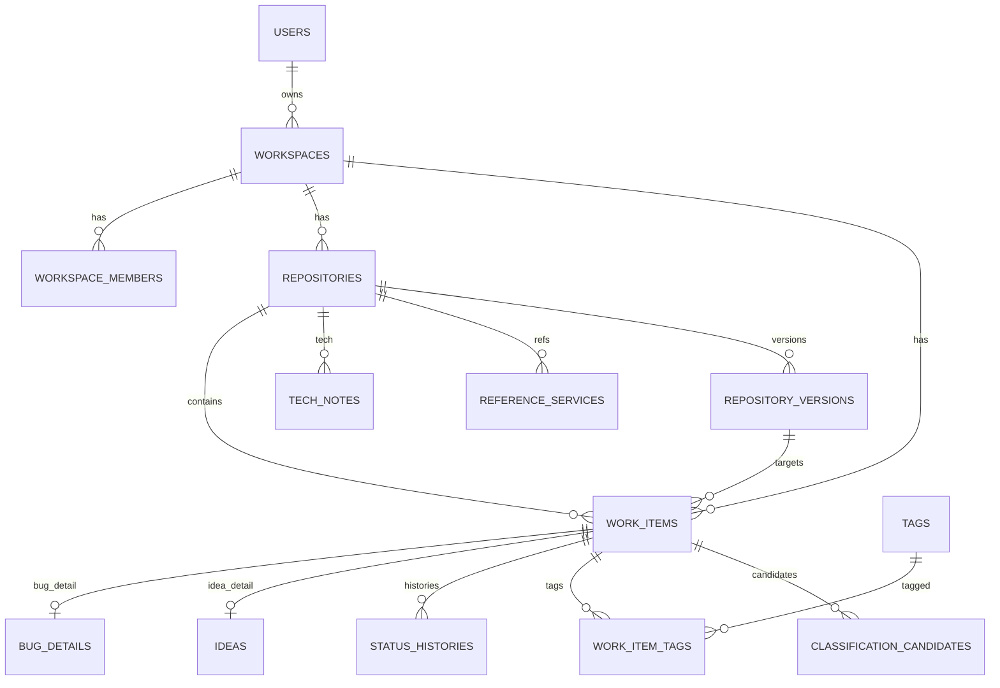

# データモデル設計

## 基本方針

NextPatch の中心は `WorkItem`。タスク、バグ、アイデア、実装予定、将来機能、未整理メモを共通モデルで扱い、バグ・アイデアなど型固有情報は詳細テーブルに分離する。

採用する方式: **WorkItem 共通モデル + 型別詳細テーブル方式**。

## エンティティ一覧

| エンティティ | 役割 | MVP |
|---|---|---|
| profiles/users | 認証ユーザー参照 | ○ |
| workspaces | 個人/将来チーム単位 | ○ |
| workspace_members | RLS基準 | ○ |
| repositories | GitHub repo / 開発中アプリ | ○ |
| work_items | 中心モデル | ○ |
| bug_details | バグ詳細 | ○ |
| ideas | アイデア詳細 | ○ |
| tech_notes | 採用技術/候補 | ○ |
| reference_services | 参考サービス/競合/記事 | ○ |
| tags | ラベル | ○ |
| work_item_tags | 多対多 | ○ |
| status_histories | 状態履歴 | ○ |
| repository_versions | version/milestone | ○ |
| classification_candidates | 未整理メモ分類候補 | ○ |
| export_logs | export履歴 | ○ |
| import_jobs | import/restore履歴 | ○ |

## 主要テーブル

### repositories

| フィールド | 型 | 必須 | 説明 |
|---|---|---:|---|
| id | uuid | ○ | 内部ID |
| workspace_id | uuid | ○ | workspace |
| user_id | uuid | ○ | owner冗長保持 |
| provider | enum | ○ | manual/github |
| name | text | ○ | 表示名 |
| description | text |  | 説明 |
| html_url | text |  | GitHub URL |
| github_host | text |  | github.com |
| github_owner | text |  | owner |
| github_repo | text |  | repo |
| github_full_name | text |  | owner/repo |
| production_status | enum | ○ | planning/development/active_production/maintenance/paused |
| criticality | enum | ○ | high/medium/low |
| current_focus | text |  | 現在の目的 |
| next_version_id | uuid |  | 次version |
| is_favorite | boolean | ○ | favorite |
| sort_order | int |  | 並び順 |
| created_at/updated_at | timestamptz | ○ | 作成/更新 |
| archived_at/deleted_at | timestamptz |  | アーカイブ/論理削除 |

### work_items

| フィールド | 型 | 必須 | 説明 |
|---|---|---:|---|
| id | uuid | ○ | ID |
| workspace_id | uuid | ○ | workspace |
| user_id | uuid | ○ | owner |
| repository_id | uuid nullable |  | repo未確定ならnull |
| scope | enum | ○ | repository/inbox/global |
| type | enum | ○ | task/bug/idea/implementation/future_feature/memo |
| title | text | ○ | タイトル |
| body | text |  | 本文 |
| status | enum | ○ | 種別別状態 |
| resolution | enum nullable |  | completed/not_planned/duplicate等 |
| priority | enum | ○ | p0〜p4 |
| source_type | enum | ○ | manual/chatgpt/github/web/import/system |
| source_ref | text |  | URL/会話ID |
| privacy_level | enum | ○ | normal/confidential/secret/no_ai |
| is_pinned | boolean | ○ | Now固定 |
| target_version_id | uuid |  | version |
| due_at | timestamptz |  | 期限 |
| external_url | text |  | GitHub等 |
| external_provider | enum |  | github |
| external_id | text |  | 外部ID |
| status_changed_at | timestamptz |  | 状態変更 |
| completed_at | timestamptz |  | 肯定的完了 |
| closed_at | timestamptz |  | 終了 |
| archived_at/deleted_at | timestamptz |  | 表示制御/論理削除 |
| created_at/updated_at | timestamptz | ○ | 作成/更新 |

## repositoryId nullable

`repository_id` は nullable とする。理由は、未整理メモ、横断アイデア、共通技術メモを正規に扱うため。

| scope | repository_id | 使い方 |
|---|---|---|
| repository | NOT NULL | repoに属する項目 |
| inbox | NULL | repo未確定の未整理メモ |
| global | NULL | 全体方針・横断メモ |

DB check constraint で scope と repository_id の整合性を保証する。

## 日時フィールド

| フィールド | ルール |
|---|---|
| created_at | サーバー側で設定。復元時は保持 |
| updated_at | 更新時にサーバー側で更新 |
| completed_at | completed=true の状態へ入った時に自動設定 |
| closed_at | closed=true の状態へ入った時に設定 |
| archived_at | アーカイブ時に設定。状態とは分離 |
| deleted_at | 論理削除時に設定 |

## アーカイブと削除

- アーカイブ: 通常一覧から隠す。検索・復元可能。
- 論理削除: ゴミ箱相当。所有者のみ復元可能。
- 物理削除: 明示的な最終操作。重要操作前 backup 必須。

## ER図

