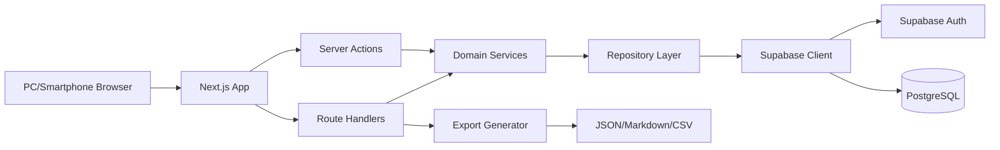

# 技術アーキテクチャ（ローカルサーバー版）

## 推奨技術スタック

| 領域 | 採用 |
|---|---|
| アプリ | Next.js App Router |
| 言語 | TypeScript |
| UI | React + DADSベース独自コンポーネント |
| DB/Auth | Supabase Local / Self-hosted Supabase |
| DB | PostgreSQL |
| 認証 | Supabase Auth |
| バリデーション | Zod |
| 型生成 | Supabase generated types |
| ORM | MVPでは不採用 |
| 開発実行 | `supabase start` + `pnpm dev` |
| 常用実行 | Docker Compose |
| テスト | Vitest + Playwright + axe-core |

## 実行モード

### Mode A: 開発用ローカル実行

```text
Browser
  -> Next.js dev server
  -> Supabase local stack
  -> Local PostgreSQL
```

```bash
pnpm install
supabase start
pnpm dev
```

### Mode B: 常用ローカルサーバー実行

```text
Browser / LAN端末
  -> nextpatch-web container
  -> Supabase self-host/local services
  -> PostgreSQL volume
```

```bash
docker compose up -d
```

## 全体構成図



## フロントエンド構成

```text
src/
  app/
    dashboard/
    repositories/
    work-items/
    inbox/
    capture/
    tech-notes/
    references/
    settings/
  components/
    ui/
    layout/
    forms/
    dashboard/
  styles/
    tokens.css
```

## バックエンド構成

```text
src/server/
  actions/
  repositories/
  domain/
    status/
    dashboard/
    github-url/
    import-parser/
    export/
  validation/
  auth/
  logging/
```

## DB構成

- Supabase migrations を正本とする。
- すべての主要テーブルに `workspace_id` と `user_id`。
- RLS を必須。
- `repository_id` nullable + `scope` check constraint。

## 認証構成

- Supabase Auth。
- メール OTP / magic link。
- 開発では Supabase local のメール確認。
- 常用では SMTP 設定を README に明記。

## バリデーション

- Zod schema を UI/server action/route handler で共有。
- クライアント検証はUX補助。最終検証はサーバー。

## エラーハンドリング

- validation: field errors。
- auth: login誘導。
- permission: 403/404方針統一。
- system: settings/system に状態表示。
- log: 本文とsecretを残さない。

## ログ方針

記録する:

- requestId
- userId
- workspaceId
- action
- resourceType/resourceId
- statusCode/errorCode

記録しない:

- メモ本文
- ChatGPT全文
- GitHub token
- API key
- Cookie
- Authorization header

## ホスティング方針

- MVPはローカル Docker Compose。
- 外部公開は非推奨。
- LAN公開でも認証必須。
- 外部公開する場合は HTTPS、SMTP、backup、強い secret を必須にする。

## PWA方針

- manifest とアイコンのみ。
- 完全オフライン同期は後回し。
- 未送信下書き保存は P1 で検討。

## 将来連携に備える構造

GitHub:

- repositories に owner/repo/fullName。
- work_items に externalProvider/externalId/externalUrl。
- 将来 `integration_accounts`, `sync_jobs`, `integration_events`。

ChatGPT/AI:

- memo 原文と classification_candidates を分離。
- privacyLevel と aiProcessingAllowed。
- 将来 `ai_runs`。

## ローカル運用READMEに必ず書くこと

- 必要条件: Node.js, pnpm, Docker, Supabase CLI。
- 開発起動手順。
- 常用起動手順。
- 停止手順。
- `.env` 設定。
- Supabase URL/key 確認方法。
- migration 適用。
- JSON export の重要性。
- DB volume backup。
- SMTP 注意。
- 外部公開時の注意。
