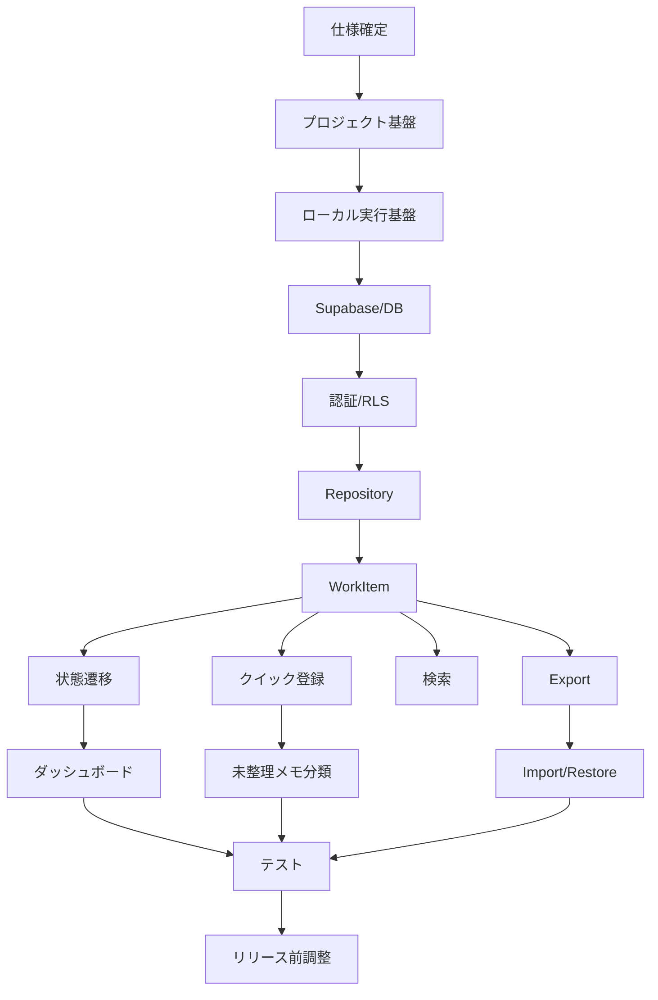

# 詳細作業計画書

## フェーズ計画

| フェーズ | 目的 | 作業 | 成果物 | 依存関係 | 完了条件 |
|---|---|---|---|---|---|
| 仕様確定 | 実装前の判断を固定 | 本書レビュー、未決定事項整理 | final spec | なし | MVP範囲合意 |
| プロジェクト基盤 | Next.js基盤 | pnpm, Next.js, TS, lint, test | app skeleton | 仕様確定 | build成功 |
| ローカル実行基盤 | ローカル起動 | Dockerfile, compose, env.example | runtime docs | 基盤 | docker起動 |
| Supabase local | DB/Auth起動 | supabase init, config, migrations | local stack | 基盤 | supabase start成功 |
| データモデル | DB正本 | migration, generated types | schema | Supabase | migration通過 |
| 認証 | private-by-default | Supabase Auth, protected routes | auth flow | DB | login必須 |
| リポジトリ管理 | repo登録 | CRUD, URL parser | repository feature | Auth | owner/repo保存 |
| WorkItem管理 | item登録 | CRUD, detail tables | item feature | repo | CRUD成功 |
| 状態遷移 | 整合性 | status service, histories | transition logic | WorkItem | completedAt正しい |
| ダッシュボード | 今やる表示 | tier query, sections | dashboard | 状態 | 理由表示 |
| クイック登録 | 3操作登録 | capture form, memo save | capture | WorkItem | repoなし保存 |
| 未整理メモ分類 | memo→item | parser, candidate, apply | triage | capture | 元メモ保持 |
| 検索・絞り込み | 探せる | query params, filters | work item list | WorkItem | 条件一致 |
| UIスタイルガイド適用 | DADS準拠 | tokens, components, forms | UI kit | 画面 | a11y確認 |
| レスポンシブ対応 | スマホ対応 | mobile menu, cards | responsive UI | UI | 横スクロールなし |
| エクスポート | データ保全 | JSON/MD/CSV export | export | data | JSON作成 |
| インポート/復元 | 復旧 | validate, restore new workspace | import | export | round-trip成功 |
| テスト | 品質固定 | unit/integration/e2e/a11y | test suite | all | CI通過 |
| リリース前調整 | 運用可能化 | README, security checklist, sample data | release candidate | all | 手順再現 |

## 依存関係の要点

## マージ順序

1. project foundation
2. local runtime
3. database/auth/security
4. repository domain
5. work item domain
6. state/dashboard
7. quick capture/triage
8. export/import
9. UI DADS responsive
10. tests/release docs

## サブエージェント運用

- 各サブエージェントは必ず個別 worktree で作業する。
- main agent がサブエージェントの起動順・マージ順を統括する。
- 競合が起きやすい DB schema と UI layout は main agent が先に境界を固定する。
- 各サブエージェントは変更ファイル、テスト結果、未対応事項を報告する。
