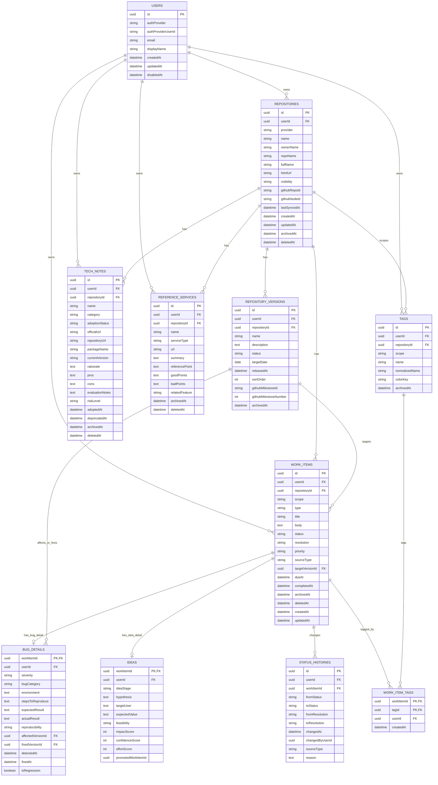

# 担当領域

ドメインモデル・データ設計。

中心判断は、NextPatch が扱う「タスク、バグ、アイデア、実装予定、将来機能、採用技術、採用候補、参考サービス、未整理メモ」を、個別テーブル中心で持つか、共通 `WorkItem` モデル中心で持つかである。

結論としては、**`WorkItem` を中心にした共通モデル + 型ごとの詳細テーブルを持つハイブリッド設計**を推奨する。

---

# 前提理解

NextPatch は、GitHub リポジトリや開発中アプリごとに、開発上の情報を整理し、利用者が「今やるべきこと」をすぐ把握できるようにするアプリである。

データ設計上の前提は次のとおり。

* 一覧・ダッシュボードでは、タスク、バグ、アイデア、実装予定、将来機能、メモを横断して並べたい。
* 一方で、バグには再現手順、期待結果、実際の結果、深刻度など、タスクとは異なる詳細情報が必要。
* 技術メモや参考サービスは、必ずしも「今すぐ実行する作業」ではないため、`WorkItem` と完全に同一視しないほうがよい。
* 未整理メモは、後でタスク・バグ・アイデアなどに変換される入口として扱うべき。
* UI では DADS ルールを優先し、重要情報を隠さず、構造化データはテーブルで扱い、フォームではラベル・サポートテキスト・エラー文を明示する前提にする。DADS では重要情報を安易にアコーディオン等へ隠さないこと、テーブルを構造化データの一覧表示・比較に使うこと、フォーム項目にはラベルやサポートテキストを設けることが示されている。
* GitHub 連携を将来行う場合、Repository、Issue、Label、Milestone との対応を見込む必要がある。GitHub REST API では repository、issue、label、milestone、assignee などが個別に扱われ、Issue には `title`、`body`、`milestone`、`labels`、`assignees`、`type`、`state`、`state_reason` などの概念があるため、NextPatch 側も外部IDや状態理由を保持できる余地を残すべきである。確認日: 2026-04-20。([GitHub Docs][1])

なお、この回答では、アップロード確認できている資料は `dads_app_ui_design_rules_20260411.md` であり、NextPatch 要件定義書・検討メモについては、今回の依頼文に含まれる説明を前提として補完している。

---

# 決定すべき論点

1. `Task`、`Bug`、`Idea`、`ImplementationPlan`、`FutureFeature`、`Memo` を個別テーブルにするか、共通 `WorkItem` に寄せるか。
2. バグ固有項目を `WorkItem` に含めるか、`BugDetail` として分離するか。
3. アイデア固有項目を `WorkItem` に含めるか、`Idea` 詳細として分離するか。
4. 技術メモ、採用技術、採用候補技術を `WorkItem` として扱うか、`TechNote` として分離するか。
5. 参考サービスを `WorkItem` として扱うか、`ReferenceService` として分離するか。
6. `repositoryId` を nullable にするか。
7. 未整理メモを `WorkItem type=memo` として扱うか。
8. `Version` モデルを MVP から作るか。
9. 削除、アーカイブ、完了をどのように区別するか。
10. `createdAt`、`updatedAt`、`completedAt`、`archivedAt`、`deletedAt` をどのエンティティに持たせるか。
11. `userId` によるデータ分離をどの階層で保証するか。
12. タグを `WorkItem` 専用にするか、技術メモ・参考サービスにも使えるようにするか。
13. ステータス変更履歴を MVP に含めるか。
14. 将来の GitHub 同期、AIメモ取込、横断検索に耐えられるか。

---

# 選択肢比較

## 中心モデルの選択肢

| 案                         | 内容                                                    | 長所                          | 短所                                                  | 評価     |
| ------------------------- | ----------------------------------------------------- | --------------------------- | --------------------------------------------------- | ------ |
| A. 完全個別テーブル方式             | `tasks`、`bugs`、`ideas`、`memos` などをすべて別テーブルにする         | 各型の項目を厳密に設計しやすい             | 「今やるべきこと」一覧が UNION だらけになる。ステータス、優先度、タグ、アーカイブ処理が重複する | 非推奨    |
| B. 完全共通 WorkItem 方式       | すべてを `work_items` だけで持つ                               | 一覧、検索、並び替えが簡単               | バグ固有項目や技術評価項目が nullable だらけになる。型ごとの整合性が弱い           | 非推奨    |
| C. 共通 WorkItem + 詳細テーブル方式 | 共通項目は `work_items`、型固有項目は `bug_details`、`ideas` などに分離 | 横断一覧と型別詳細を両立できる。MVP後も拡張しやすい | JOIN が増える。型と詳細テーブルの整合性チェックが必要                       | **推奨** |

## 個別論点の比較

| 論点             | 選択肢                             |                   推奨 | 理由                                  |
| -------------- | ------------------------------- | -------------------: | ----------------------------------- |
| `repositoryId` | 必須 / nullable                   |         **nullable** | 未整理メモ、横断アイデア、共通技術メモを置けるようにするため      |
| 未整理メモ          | 別テーブル / `WorkItem type=memo`    |         **WorkItem** | 後でタスク・バグ・アイデアへ変換しやすい                |
| 採用技術と候補技術      | 別テーブル / 同一 `TechNote`           |    **同一 `TechNote`** | `adoptionStatus` の変更で候補→採用→廃止を表現できる |
| 参考サービス         | `WorkItem` / `ReferenceService` | **ReferenceService** | 参考情報は必ずしも作業ではないため                   |
| バグ詳細           | `WorkItem` に混在 / `BugDetail`    |        **BugDetail** | 再現手順、期待結果、実際結果、深刻度を構造化できる           |
| アイデア詳細         | `WorkItem` の本文だけ / `Idea` 詳細    |          **Idea 詳細** | 価値仮説、対象ユーザー、実現性、採用判断を持てる            |
| Version        | 作らない / MVPから作る                  |       **MVPから軽量に作る** | 実装予定・将来機能・バグ修正をリリース単位で整理できる         |
| 削除             | 物理削除のみ / 論理削除                   |           **論理削除優先** | 誤削除復元、履歴保持、GitHub連携時の差分処理に有利        |
| アーカイブ          | ステータス扱い / `archivedAt`          |     **`archivedAt`** | 完了・中止とは別に、一覧から隠す操作として扱える            |
| ステータス履歴        | なし / `StatusHistory`            |          **MVPから作る** | 進捗管理アプリとして、状態変更の追跡価値が高い             |

---

# 推奨案

## 推奨する基本方針

**`WorkItem` を中心に置き、バグやアイデアなど型固有の情報だけを詳細テーブルに分離する。**

具体的には、次の構成を推奨する。

* タスク、バグ、アイデア、実装予定、将来機能、未整理メモ
  → `WorkItem` として管理する。
* バグ固有項目
  → `BugDetail` に分離する。
* アイデア固有項目
  → `Idea` に分離する。
* 採用技術、採用候補技術、廃止技術
  → `TechNote` にまとめ、`adoptionStatus` で区別する。
* 参考サービス
  → `ReferenceService` として独立させる。
* タグ
  → `Tag` を共通化し、MVPでは少なくとも `WorkItemTag` を作る。技術メモ・参考サービスにもタグ付けするなら `TechNoteTag`、`ReferenceServiceTag` を追加する。
* リリース単位
  → `RepositoryVersion` を作る。画面表示上は「Version」でよいが、DB名は予約語や汎用語衝突を避けるため `repository_versions` を推奨する。
* ステータス変更履歴
  → `StatusHistory` を MVP から作る。

## 判断理由

この設計は、NextPatch の主目的である「今やるべきことをすぐ把握する」ために最も適している。

完全個別テーブル方式にすると、タスク、バグ、アイデア、将来機能を横断する一覧が複雑になる。逆に完全共通 `WorkItem` 方式にすると、バグ詳細や技術評価項目が nullable だらけになり、データ品質が落ちる。

そのため、**一覧・検索・優先度・状態・タグ・アーカイブは `WorkItem` に統一し、型固有の構造だけを詳細テーブルに逃がす**のがよい。

---

# MVPに含めるべき内容

MVPでは、次のテーブルを作るべきである。

1. `repositories`
2. `work_items`
3. `bug_details`
4. `ideas`
5. `tech_notes`
6. `reference_services`
7. `tags`
8. `work_item_tags`
9. `status_histories`
10. `repository_versions`

MVPに含める機能は次の範囲にする。

| 機能         | MVPでの扱い                                                    |
| ---------- | ---------------------------------------------------------- |
| リポジトリ登録    | 手動登録 + 将来のGitHub連携用フィールドを保持                                |
| WorkItem作成 | task / bug / idea / implementation / future_feature / memo |
| バグ詳細       | 再現手順、期待結果、実際結果、深刻度、環境                                      |
| アイデア詳細     | 価値仮説、対象ユーザー、実現性、判断状態                                       |
| 技術メモ       | 採用済み、候補、評価中、却下、廃止を同一モデルで管理                                 |
| 参考サービス     | サービス名、URL、参考ポイント、対象リポジトリ                                   |
| タグ         | WorkItemへのタグ付け                                             |
| ステータス履歴    | WorkItemの状態変更履歴                                            |
| Version    | リリース予定、対象バージョン、リリース済みの管理                                   |
| アーカイブ      | `archivedAt` による非表示化                                       |
| 削除         | `deletedAt` による論理削除                                        |

---

# MVPでは後回しにする内容

次は MVP 後でよい。

| 後回し項目                     | 理由                                     |
| ------------------------- | -------------------------------------- |
| GitHub双方向同期               | 認可、差分解決、ラベル・マイルストーン対応が重い               |
| GitHub Issue / PR 完全マッピング | MVPでは外部URL・外部ID保持程度で十分                 |
| コメント・議論スレッド               | 初期は本文とメモで代替可能                          |
| 添付ファイル                    | ストレージ、権限、容量制御が必要                       |
| 汎用 ActivityLog            | まずは WorkItem の `StatusHistory` で足りる    |
| WorkItem 間依存関係            | 「この作業が終わらないと次へ進めない」管理は後でよい             |
| カスタムフィールド                 | 初期から入れると画面・検索・バリデーションが複雑化する            |
| 複数ユーザー共同編集                | まずは `userId` 分離を前提に単独利用を固める            |
| 権限ロール                     | チーム利用段階で追加                             |
| AI要約・自動分類履歴               | source情報だけ残し、詳細なAIログは後回し               |
| 技術メモ・参考サービスへのタグ付け         | MVPで必要なら追加。最小MVPでは WorkItem タグだけでも成立する |

---

# データ設計への影響

## 1. 推奨エンティティ一覧

| エンティティ                | 役割                                |        MVP |
| --------------------- | --------------------------------- | ---------: |
| `User` / `AppUser`    | データ所有者。外部Authを使う場合はアプリ側では参照のみでもよい |       条件付き |
| `Repository`          | 管理対象のGitHubリポジトリまたは開発中アプリ         |         必須 |
| `WorkItem`            | タスク、バグ、アイデア、実装予定、将来機能、未整理メモの共通本体  |         必須 |
| `BugDetail`           | バグ固有情報                            |         必須 |
| `Idea`                | アイデア固有情報                          |         必須 |
| `TechNote`            | 採用技術・採用候補・廃止技術の記録                 |         必須 |
| `ReferenceService`    | 参考サービス・競合・参考UI・参考プロダクトの記録         |         必須 |
| `Tag`                 | 分類ラベル                             |         必須 |
| `WorkItemTag`         | WorkItem と Tag の中間テーブル            |         必須 |
| `StatusHistory`       | WorkItem のステータス変更履歴               |         必須 |
| `RepositoryVersion`   | リポジトリ単位のリリース・バージョン・マイルストーン        |         必須 |
| `TechNoteTag`         | TechNote と Tag の中間テーブル            | 将来または拡張MVP |
| `ReferenceServiceTag` | ReferenceService と Tag の中間テーブル    | 将来または拡張MVP |
| `WorkItemRelation`    | WorkItem 間の依存・重複・関連               |         将来 |
| `ExternalLink`        | GitHub Issue、PR、設計書、Web資料などの外部リンク |         将来 |
| `Attachment`          | 画像、ログ、スクリーンショット等                  |         将来 |
| `Comment`             | WorkItem に対する議論・追記                |         将来 |

---

## 2. 各エンティティのフィールド一覧

## `users` / `app_users`

外部認証基盤を使う場合でも、アプリDB側で参照用ユーザーを持つと、将来のチーム機能や監査に拡張しやすい。

| フィールド                | 型        | 必須 | 説明                             |
| -------------------- | -------- | -: | ------------------------------ |
| `id`                 | UUID     |  ○ | アプリ内ユーザーID                     |
| `authProvider`       | enum     |  ○ | `google`, `github`, `email` など |
| `authProviderUserId` | string   |  ○ | 外部認証側ID                        |
| `email`              | string   |  ○ | メールアドレス                        |
| `displayName`        | string   |    | 表示名                            |
| `createdAt`          | datetime |  ○ | 作成日時                           |
| `updatedAt`          | datetime |  ○ | 更新日時                           |
| `disabledAt`         | datetime |    | 利用停止日時                         |

---

## `repositories`

`Repository` は、GitHubリポジトリだけでなく、手動登録した開発中アプリも表せるようにする。

| フィールド           | 型        | 必須 | 説明                                         |
| --------------- | -------- | -: | ------------------------------------------ |
| `id`            | UUID     |  ○ | リポジトリID                                    |
| `userId`        | UUID     |  ○ | 所有ユーザー                                     |
| `provider`      | enum     |  ○ | `manual`, `github`                         |
| `name`          | string   |  ○ | 表示名                                        |
| `ownerName`     | string   |    | GitHub owner / organization                |
| `repoName`      | string   |    | GitHub repository name                     |
| `fullName`      | string   |    | `owner/repo` 形式                            |
| `description`   | text     |    | 説明                                         |
| `htmlUrl`       | string   |    | GitHub等のURL                                |
| `defaultBranch` | string   |    | 既定ブランチ                                     |
| `visibility`    | enum     |  ○ | `public`, `private`, `internal`, `unknown` |
| `githubRepoId`  | string   |    | GitHub REST API側の repository id            |
| `githubNodeId`  | string   |    | GitHub GraphQL側 node id                    |
| `lastSyncedAt`  | datetime |    | 最終同期日時                                     |
| `isFavorite`    | boolean  |  ○ | よく使うリポジトリか                                 |
| `sortOrder`     | integer  |    | 手動並び替え                                     |
| `createdAt`     | datetime |  ○ | 作成日時                                       |
| `updatedAt`     | datetime |  ○ | 更新日時                                       |
| `archivedAt`    | datetime |    | NextPatch上でのアーカイブ日時                        |
| `deletedAt`     | datetime |    | 論理削除日時                                     |

制約案:

| 制約     | 内容                                                            |
| ------ | ------------------------------------------------------------- |
| unique | `(userId, provider, githubRepoId)` は `githubRepoId` がある場合ユニーク |
| index  | `(userId, archivedAt, deletedAt)`                             |
| index  | `(userId, fullName)`                                          |

---

## `work_items`

`WorkItem` は NextPatch の中心テーブル。

| フィールド              | 型              | 必須 | 説明                                                                |
| ------------------ | -------------- | -: | ----------------------------------------------------------------- |
| `id`               | UUID           |  ○ | WorkItem ID                                                       |
| `userId`           | UUID           |  ○ | 所有ユーザー                                                            |
| `repositoryId`     | UUID nullable  |    | 紐づくリポジトリ。未整理・横断メモでは null                                          |
| `scope`            | enum           |  ○ | `repository`, `inbox`, `global`                                   |
| `type`             | enum           |  ○ | `task`, `bug`, `idea`, `implementation`, `future_feature`, `memo` |
| `title`            | string         |  ○ | タイトル                                                              |
| `body`             | text           |    | 詳細本文                                                              |
| `status`           | enum           |  ○ | 作業状態                                                              |
| `resolution`       | enum nullable  |    | 完了・中止・重複などの理由                                                     |
| `priority`         | enum           |  ○ | 優先度                                                               |
| `sourceType`       | enum           |  ○ | 手入力、ChatGPT、GitHub、Web等                                           |
| `sourceRef`        | string         |    | 取込元識別子、URL、会話IDなど                                                 |
| `targetVersionId`  | UUID nullable  |    | 対象予定バージョン                                                         |
| `dueAt`            | datetime       |    | 期限                                                                |
| `rank`             | decimal/string |    | 並び順。Kanbanや優先順位調整用                                                |
| `externalUrl`      | string         |    | GitHub Issue等へのリンク                                                |
| `externalProvider` | enum nullable  |    | `github` など                                                       |
| `externalId`       | string         |    | 外部サービス側ID                                                         |
| `createdAt`        | datetime       |  ○ | 作成日時                                                              |
| `updatedAt`        | datetime       |  ○ | 更新日時                                                              |
| `completedAt`      | datetime       |    | 完了日時                                                              |
| `archivedAt`       | datetime       |    | アーカイブ日時                                                           |
| `deletedAt`        | datetime       |    | 論理削除日時                                                            |

重要な制約:

| 制約    | 内容                                                    |
| ----- | ----------------------------------------------------- |
| check | `scope = repository` の場合 `repositoryId IS NOT NULL`   |
| check | `scope IN (inbox, global)` の場合 `repositoryId IS NULL` |
| check | `completedAt IS NOT NULL` は原則 `status = done` のとき     |
| index | `(userId, repositoryId, status, priority)`            |
| index | `(userId, type, status)`                              |
| index | `(userId, archivedAt, deletedAt)`                     |
| index | `(userId, targetVersionId)`                           |

---

## `bug_details`

`BugDetail` は `work_items.type = bug` のときだけ作る 1:1 詳細。

| フィールド               | 型         | 必須 | 説明                |
| ------------------- | --------- | -: | ----------------- |
| `workItemId`        | UUID      |  ○ | PK兼FK             |
| `userId`            | UUID      |  ○ | 所有ユーザー            |
| `severity`          | enum      |  ○ | 深刻度               |
| `bugCategory`       | enum      |    | UI、データ、性能、セキュリティ等 |
| `environment`       | text/json |    | OS、ブラウザ、端末、環境     |
| `stepsToReproduce`  | text      |    | 再現手順              |
| `expectedResult`    | text      |    | 期待結果              |
| `actualResult`      | text      |    | 実際結果              |
| `reproducibility`   | enum      |    | 常時、時々、稀、不明        |
| `affectedVersionId` | UUID      |    | 影響バージョン           |
| `fixedVersionId`    | UUID      |    | 修正バージョン           |
| `detectedAt`        | datetime  |    | 検知日時              |
| `fixedAt`           | datetime  |    | 修正日時              |
| `isRegression`      | boolean   |  ○ | リグレッションか          |
| `createdAt`         | datetime  |  ○ | 作成日時              |
| `updatedAt`         | datetime  |  ○ | 更新日時              |

---

## `ideas`

`Idea` は `work_items.type = idea` のときだけ作る 1:1 詳細。

| フィールド                | 型        | 必須 | 説明                 |
| -------------------- | -------- | -: | ------------------ |
| `workItemId`         | UUID     |  ○ | PK兼FK              |
| `userId`             | UUID     |  ○ | 所有ユーザー             |
| `ideaStage`          | enum     |  ○ | 生メモ、検討中、採用予定、保留、却下 |
| `hypothesis`         | text     |    | 価値仮説               |
| `targetUser`         | text     |    | 想定利用者              |
| `expectedValue`      | text     |    | 期待効果               |
| `feasibility`        | enum     |    | 実現性                |
| `impactScore`        | integer  |    | 影響度 1-5            |
| `confidenceScore`    | integer  |    | 確信度 1-5            |
| `effortScore`        | integer  |    | 工数感 1-5            |
| `promotedWorkItemId` | UUID     |    | 実装予定やタスクへ昇格した場合の参照 |
| `createdAt`          | datetime |  ○ | 作成日時               |
| `updatedAt`          | datetime |  ○ | 更新日時               |

---

## `tech_notes`

採用済み技術と採用候補技術は、別テーブルにせず `TechNote` にまとめる。

| フィールド               | 型             | 必須 | 説明                                  |
| ------------------- | ------------- | -: | ----------------------------------- |
| `id`                | UUID          |  ○ | 技術メモID                              |
| `userId`            | UUID          |  ○ | 所有ユーザー                              |
| `repositoryId`      | UUID nullable |    | 特定リポジトリに紐づく場合                       |
| `name`              | string        |  ○ | 技術名                                 |
| `category`          | enum          |  ○ | framework、library、database、hosting等 |
| `adoptionStatus`    | enum          |  ○ | 採用済み、候補、評価中、却下、廃止                   |
| `officialUrl`       | string        |    | 公式URL                               |
| `repositoryUrl`     | string        |    | OSSリポジトリ等                           |
| `packageName`       | string        |    | npm package等                        |
| `currentVersion`    | string        |    | 現在利用バージョン                           |
| `versionConstraint` | string        |    | バージョン制約                             |
| `licenseName`       | string        |    | ライセンス                               |
| `rationale`         | text          |    | 採用・候補理由                             |
| `pros`              | text          |    | 良い点                                 |
| `cons`              | text          |    | 懸念点                                 |
| `evaluationNotes`   | text          |    | 評価メモ                                |
| `riskLevel`         | enum          |    | リスク                                 |
| `decidedAt`         | datetime      |    | 採否判断日時                              |
| `adoptedAt`         | datetime      |    | 採用日時                                |
| `deprecatedAt`      | datetime      |    | 廃止日時                                |
| `createdAt`         | datetime      |  ○ | 作成日時                                |
| `updatedAt`         | datetime      |  ○ | 更新日時                                |
| `archivedAt`        | datetime      |    | アーカイブ日時                             |
| `deletedAt`         | datetime      |    | 論理削除日時                              |

---

## `reference_services`

参考サービス、競合サービス、参考UI、参考プロダクトを管理する。

| フィールド            | 型             | 必須 | 説明                               |
| ---------------- | ------------- | -: | -------------------------------- |
| `id`             | UUID          |  ○ | 参考サービスID                         |
| `userId`         | UUID          |  ○ | 所有ユーザー                           |
| `repositoryId`   | UUID nullable |    | 特定リポジトリに紐づく場合                    |
| `name`           | string        |  ○ | サービス名                            |
| `serviceType`    | enum          |  ○ | app、saas、oss、competitor、article等 |
| `url`            | string        |    | URL                              |
| `summary`        | text          |    | 概要                               |
| `referencePoint` | text          |    | 参考にしたい点                          |
| `goodPoints`     | text          |    | 良い点                              |
| `badPoints`      | text          |    | 懸念点・真似しない点                       |
| `relatedFeature` | string        |    | 関連機能名                            |
| `pricingNotes`   | text          |    | 価格・課金メモ                          |
| `createdAt`      | datetime      |  ○ | 作成日時                             |
| `updatedAt`      | datetime      |  ○ | 更新日時                             |
| `archivedAt`     | datetime      |    | アーカイブ日時                          |
| `deletedAt`      | datetime      |    | 論理削除日時                           |

---

## `tags`

タグはユーザー単位またはリポジトリ単位で使えるようにする。

| フィールド            | 型             | 必須 | 説明                           |
| ---------------- | ------------- | -: | ---------------------------- |
| `id`             | UUID          |  ○ | タグID                         |
| `userId`         | UUID          |  ○ | 所有ユーザー                       |
| `repositoryId`   | UUID nullable |    | リポジトリ専用タグなら設定                |
| `scope`          | enum          |  ○ | `user`, `repository`         |
| `name`           | string        |  ○ | 表示名                          |
| `normalizedName` | string        |  ○ | 重複判定用                        |
| `colorKey`       | string        |    | UI側の定義済み色キー。自由な16進色はMVPでは避ける |
| `description`    | text          |    | 説明                           |
| `createdAt`      | datetime      |  ○ | 作成日時                         |
| `updatedAt`      | datetime      |  ○ | 更新日時                         |
| `archivedAt`     | datetime      |    | アーカイブ日時                      |

制約:

| 制約     | 内容                                                  |
| ------ | --------------------------------------------------- |
| unique | `(userId, repositoryId, normalizedName)`            |
| check  | `scope = repository` の場合 `repositoryId IS NOT NULL` |
| check  | `scope = user` の場合 `repositoryId IS NULL`           |

---

## `work_item_tags`

| フィールド        | 型        | 必須 | 説明                  |
| ------------ | -------- | -: | ------------------- |
| `workItemId` | UUID     |  ○ | WorkItem            |
| `tagId`      | UUID     |  ○ | Tag                 |
| `userId`     | UUID     |  ○ | 所有ユーザー。検索・RLS用に冗長保持 |
| `createdAt`  | datetime |  ○ | 付与日時                |

制約:

| 制約          | 内容                    |
| ----------- | --------------------- |
| primary key | `(workItemId, tagId)` |
| index       | `(userId, tagId)`     |

---

## `status_histories`

MVPから作る。`WorkItem` の状態変更履歴に特化する。

| フィールド             | 型             | 必須 | 説明                       |
| ----------------- | ------------- | -: | ------------------------ |
| `id`              | UUID          |  ○ | 履歴ID                     |
| `userId`          | UUID          |  ○ | 所有ユーザー                   |
| `workItemId`      | UUID          |  ○ | 対象WorkItem               |
| `fromStatus`      | enum nullable |    | 変更前ステータス                 |
| `toStatus`        | enum          |  ○ | 変更後ステータス                 |
| `fromResolution`  | enum nullable |    | 変更前解決理由                  |
| `toResolution`    | enum nullable |    | 変更後解決理由                  |
| `changedAt`       | datetime      |  ○ | 変更日時                     |
| `changedByUserId` | UUID          |    | 変更者                      |
| `sourceType`      | enum          |  ○ | manual、github、import、ai等 |
| `reason`          | text          |    | 変更理由メモ                   |

---

## `repository_versions`

画面上は「Version」でよいが、DB名は `repository_versions` を推奨する。

| フィールド                   | 型        | 必須 | 説明                                        |
| ----------------------- | -------- | -: | ----------------------------------------- |
| `id`                    | UUID     |  ○ | バージョンID                                   |
| `userId`                | UUID     |  ○ | 所有ユーザー                                    |
| `repositoryId`          | UUID     |  ○ | 対象リポジトリ                                   |
| `name`                  | string   |  ○ | `v0.1.0`、`MVP`、`Phase 1` など               |
| `description`           | text     |    | 説明                                        |
| `status`                | enum     |  ○ | planned、active、released、canceled、archived |
| `targetDate`            | date     |    | 予定日                                       |
| `releasedAt`            | datetime |    | リリース日時                                    |
| `sortOrder`             | integer  |    | 並び順                                       |
| `githubMilestoneId`     | string   |    | GitHub Milestone ID                       |
| `githubMilestoneNumber` | integer  |    | GitHub Milestone number                   |
| `createdAt`             | datetime |  ○ | 作成日時                                      |
| `updatedAt`             | datetime |  ○ | 更新日時                                      |
| `archivedAt`            | datetime |    | アーカイブ日時                                   |

---

## 3. enum定義案

## `RepositoryProvider`

```text
manual
github
```

将来:

```text
gitlab
bitbucket
```

## `RepositoryVisibility`

```text
public
private
internal
unknown
```

## `WorkItemScope`

```text
repository
inbox
global
```

| 値            | 意味               |
| ------------ | ---------------- |
| `repository` | 特定リポジトリに紐づく      |
| `inbox`      | 未整理。リポジトリ未確定     |
| `global`     | 全体方針、横断アイデア、共通知識 |

## `WorkItemType`

```text
task
bug
idea
implementation
future_feature
memo
```

| 値                | 意味                 |
| ---------------- | ------------------ |
| `task`           | 通常タスク              |
| `bug`            | バグ                 |
| `idea`           | 新規アイデア             |
| `implementation` | 実装予定               |
| `future_feature` | 将来機能               |
| `memo`           | 未整理メモ、ChatGPT壁打ちメモ |

## `WorkItemStatus`

```text
inbox
backlog
ready
in_progress
blocked
review
done
```

| 値             | 意味    |
| ------------- | ----- |
| `inbox`       | 未整理   |
| `backlog`     | いつか対応 |
| `ready`       | 着手可能  |
| `in_progress` | 作業中   |
| `blocked`     | 停止中   |
| `review`      | 確認中   |
| `done`        | 完了    |

## `WorkItemResolution`

```text
completed
not_planned
duplicate
cannot_reproduce
obsolete
converted
```

| 値                  | 意味       |
| ------------------ | -------- |
| `completed`        | 完了       |
| `not_planned`      | 対応しない    |
| `duplicate`        | 重複       |
| `cannot_reproduce` | 再現不可     |
| `obsolete`         | 古くなった    |
| `converted`        | 別種別へ変換済み |

GitHub Issue の `state_reason` には `completed`、`not_planned`、`duplicate`、`reopened` 等があり、将来GitHub連携する場合は `resolution` とのマッピングを考えやすい。確認日: 2026-04-20。([GitHub Docs][2])

## `Priority`

```text
p0_urgent
p1_high
p2_medium
p3_low
p4_someday
```

## `SourceType`

```text
manual
chatgpt
github
web
import
system
```

## `BugSeverity`

```text
s0_blocker
s1_critical
s2_major
s3_minor
s4_trivial
```

## `BugCategory`

```text
functional
ui
performance
security
data
build
test
documentation
other
```

## `Reproducibility`

```text
always
sometimes
rare
unknown
```

## `IdeaStage`

```text
raw
considering
planned
parked
rejected
promoted
```

## `Feasibility`

```text
high
medium
low
unknown
```

## `TechCategory`

```text
language
framework
library
database
orm
hosting
ci_cd
testing
design
analytics
ai
security
other
```

## `TechAdoptionStatus`

```text
candidate
evaluating
adopted
rejected
deprecated
watching
```

## `RiskLevel`

```text
low
medium
high
unknown
```

## `ReferenceServiceType`

```text
app
saas
oss
competitor
article
documentation
design_reference
api
other
```

## `TagScope`

```text
user
repository
```

## `RepositoryVersionStatus`

```text
planned
active
released
canceled
archived
```

---

## 4. リレーション一覧

| From                | To                  |    多重度 | 説明                            |
| ------------------- | ------------------- | -----: | ----------------------------- |
| `User`              | `Repository`        |    1:N | ユーザーは複数リポジトリを持つ               |
| `User`              | `WorkItem`          |    1:N | WorkItem は必ずユーザーに属する          |
| `Repository`        | `WorkItem`          |    1:N | WorkItem は任意で Repository に属する |
| `WorkItem`          | `BugDetail`         | 1:0..1 | `type=bug` のとき作成              |
| `WorkItem`          | `Idea`              | 1:0..1 | `type=idea` のとき作成             |
| `WorkItem`          | `StatusHistory`     |    1:N | 状態変更履歴                        |
| `Repository`        | `RepositoryVersion` |    1:N | リポジトリごとのバージョン                 |
| `RepositoryVersion` | `WorkItem`          |    1:N | WorkItem の対象バージョン             |
| `RepositoryVersion` | `BugDetail`         |    1:N | 影響・修正バージョン                    |
| `User`              | `Tag`               |    1:N | ユーザーごとのタグ                     |
| `Repository`        | `Tag`               |    1:N | リポジトリ専用タグ                     |
| `WorkItem`          | `Tag`               |    N:N | `WorkItemTag` 経由              |
| `Repository`        | `TechNote`          |    1:N | 技術メモは任意でリポジトリに属する             |
| `Repository`        | `ReferenceService`  |    1:N | 参考サービスは任意でリポジトリに属する           |

---

## 5. ER図 Mermaid 案



---

## 6. MVPで作るテーブル

| テーブル                  | MVPで必要な理由                   |
| --------------------- | --------------------------- |
| `repositories`        | リポジトリ単位で整理するアプリの基礎          |
| `work_items`          | 今やるべきこと一覧の中心                |
| `bug_details`         | バグ情報は構造化しないと後で検索・再現確認しづらい   |
| `ideas`               | アイデアを単なるメモで終わらせず、採用判断へ進めるため |
| `tech_notes`          | 採用技術・候補技術の判断を残すため           |
| `reference_services`  | 参考サービス・競合の観察を整理するため         |
| `tags`                | 横断分類・絞り込みに必須                |
| `work_item_tags`      | WorkItem とタグの多対多            |
| `status_histories`    | 状態変更の根拠を残すため                |
| `repository_versions` | 実装予定・バグ修正・将来機能をリリース単位で見るため  |

---

## 7. 将来追加するテーブル

| テーブル                     | 追加タイミング                        | 目的             |
| ------------------------ | ------------------------------ | -------------- |
| `comments`               | WorkItem詳細で議論・追記が増えたら          | 作業ログや会話を本文から分離 |
| `attachments`            | バグのスクショ・ログ保存が必要になったら           | ファイル管理         |
| `external_links`         | GitHub Issue、PR、設計書などのリンクが増えたら | 外部参照を正規化       |
| `work_item_relations`    | 依存、重複、派生、ブロック関係が必要になったら        | WorkItem間の関係管理 |
| `tech_note_tags`         | 技術メモをタグで整理したくなったら              | TechNote分類     |
| `reference_service_tags` | 参考サービスが増えたら                    | 参考サービス分類       |
| `activity_logs`          | ステータス以外の変更履歴も必要になったら           | 汎用監査ログ         |
| `repository_members`     | チーム利用を始めたら                     | 共同編集・権限管理      |
| `github_sync_states`     | GitHub同期を始めたら                  | 差分同期、カーソル、失敗管理 |
| `ai_extraction_logs`     | ChatGPTメモの自動分類を始めたら            | AI処理結果の追跡      |

---

## 8. データ移行で注意すべき点

| 注意点                                        | 対策                                                       |
| ------------------------------------------ | -------------------------------------------------------- |
| 個別テーブル方式から `WorkItem` 方式へ移行すると、ID体系が変わる    | 旧IDと新IDの対応表を一時テーブルで保持する                                  |
| `repositoryId` を後から nullable に変えると既存制約が壊れる | MVP時点から nullable + `scope` で設計する                         |
| メモを後から WorkItem に統合すると本文・作成日時・取込元が失われやすい   | 最初から `type=memo` として `sourceType`、`sourceRef` を保持する      |
| 採用技術と候補技術を別テーブルにすると、候補→採用時に移動が必要           | 最初から `TechNote.adoptionStatus` で表現する                     |
| ステータスenumを増やすと履歴やフィルタが壊れやすい                | `status` は少数に保ち、理由は `resolution` に分ける                    |
| `deletedAt` を後から入れると既存クエリが削除済みを表示する        | MVPから全一覧クエリに `deletedAt IS NULL` を標準条件にする                |
| GitHub同期を後から入れると外部IDの重複処理が難しい              | `externalProvider`、`externalId`、`githubRepoId` 等の余地を先に持つ |
| タグ名の表記ゆれが起きる                               | `normalizedName` を保存しユニーク制約に使う                           |
| ユーザー分離を後から追加すると全テーブル移行が重い                  | MVPから主要テーブルに `userId` を持つ                                |
| バージョン名を単なる文字列だけで持つとリリース管理に拡張しづらい           | `repository_versions` を作り、WorkItemから参照する                 |

---

# 画面設計への影響

## 基本方針

データモデル上 `WorkItem` を中心にするため、画面も「WorkItem一覧」を中心に設計する。

DADS では、重要な情報を隠さないこと、画面単体ではなく利用者の流れで判断すること、テーブルを構造化データの一覧・比較・編集に使うことが示されている。NextPatch では「今やるべきこと」を最重要情報として、トップ画面またはリポジトリ詳細画面の最上位に出すべきである。

## 主要画面への影響

| 画面            | データ設計からの影響                                                         |
| ------------- | ------------------------------------------------------------------ |
| ホーム / ダッシュボード | `work_items` を `status`, `priority`, `dueAt`, `repositoryId` で横断表示 |
| リポジトリ詳細       | `repositories` を起点に WorkItem、Version、TechNote、ReferenceService を表示 |
| WorkItem一覧    | `type` で task / bug / idea / memo 等を切り替え。個別テーブルではなく同一一覧            |
| WorkItem詳細    | 共通項目 + type別詳細セクション。`bug` なら `BugDetail`、`idea` なら `Idea`          |
| 未整理Inbox      | `scope=inbox` または `type=memo` の WorkItem を表示                       |
| 技術メモ一覧        | `tech_notes` を `adoptionStatus` で分類                                |
| 参考サービス一覧      | `reference_services` をサービス種別・タグ・リポジトリで絞り込み                         |
| Version画面     | `repository_versions` ごとに対象 WorkItem を表示                           |
| タグ管理          | `tags` を user / repository スコープで管理                                 |

## UI上の注意

* WorkItem一覧はテーブルまたはカード一覧にする。構造化データを比較する用途ではテーブルが適する。
* `type`、`status`、`priority`、`tag` はフィルタとして扱う。
* 「未整理メモをタスクに変換」「アイデアを実装予定に昇格」などの操作は、詳細画面から 3 操作以内で完了できるようにする。
* DADS で未整備とされているタブ、モーダルダイアログ、テーブルコントロール等に強く依存する設計は避ける。使う場合は「暫定案」として扱う。
* フォームではプレースホルダーに頼らず、ラベルとサポートテキストを明示する。
* 削除操作は即時物理削除ではなく、確認導線 + 論理削除にする。

---

# API・機能設計への影響

## 推奨API単位

| API                               | 内容                            |
| --------------------------------- | ----------------------------- |
| `GET /repositories`               | リポジトリ一覧                       |
| `POST /repositories`              | リポジトリ作成                       |
| `GET /repositories/:id`           | リポジトリ詳細                       |
| `GET /work-items`                 | WorkItem横断一覧                  |
| `POST /work-items`                | WorkItem作成                    |
| `GET /work-items/:id`             | WorkItem詳細                    |
| `PATCH /work-items/:id`           | WorkItem更新                    |
| `POST /work-items/:id/archive`    | アーカイブ                         |
| `POST /work-items/:id/restore`    | アーカイブ解除                       |
| `DELETE /work-items/:id`          | 論理削除                          |
| `POST /work-items/:id/convert`    | memo → task / bug / idea 等の変換 |
| `GET /repositories/:id/versions`  | Version一覧                     |
| `POST /repositories/:id/versions` | Version作成                     |
| `GET /tech-notes`                 | 技術メモ一覧                        |
| `POST /tech-notes`                | 技術メモ作成                        |
| `GET /reference-services`         | 参考サービス一覧                      |
| `POST /reference-services`        | 参考サービス作成                      |
| `GET /tags`                       | タグ一覧                          |
| `POST /tags`                      | タグ作成                          |

## WorkItem作成APIの設計

`type=bug` の場合だけ `bugDetail` を受け取る。

```json
{
  "repositoryId": "nullable",
  "scope": "repository",
  "type": "bug",
  "title": "保存時にエラーが出る",
  "body": "設定画面で保存すると500になる",
  "priority": "p1_high",
  "bugDetail": {
    "severity": "s1_critical",
    "stepsToReproduce": "1. 設定画面を開く\n2. 保存を押す",
    "expectedResult": "保存される",
    "actualResult": "500エラーになる"
  }
}
```

`type=idea` の場合だけ `idea` を受け取る。

```json
{
  "repositoryId": null,
  "scope": "global",
  "type": "idea",
  "title": "ChatGPTメモから自動でWorkItem化する",
  "body": "壁打ち内容を貼り付けると分類される",
  "idea": {
    "ideaStage": "raw",
    "hypothesis": "メモ整理の手間が減る",
    "targetUser": "個人開発者"
  }
}
```

## 変換機能

未整理メモは `WorkItem type=memo` として作成し、後から次のように変換する。

| 変換元    | 変換先              | 処理                                                       |
| ------ | ---------------- | -------------------------------------------------------- |
| `memo` | `task`           | `type` を変更し、必要なら `status=backlog`                        |
| `memo` | `bug`            | `type` を変更し、`bug_details` を作成                            |
| `memo` | `idea`           | `type` を変更し、`ideas` を作成                                  |
| `idea` | `implementation` | `type` を変更、または新しい WorkItem を作り `promotedWorkItemId` で紐づけ |
| `idea` | `future_feature` | 実装時期未定の機能として整理                                           |

履歴を残すため、変換時には `StatusHistory` または将来の `ActivityLog` に記録する。

---

# リスクと対策

| リスク                            | 内容                               | 対策                                            |
| ------------------------------ | -------------------------------- | --------------------------------------------- |
| `WorkItem` が肥大化する              | 何でも入れすぎると意味が曖昧になる                | 共通項目だけを `WorkItem` に置き、型固有項目は詳細テーブルへ分離        |
| 型と詳細テーブルの不整合                   | `type=bug` なのに `bug_details` がない | アプリケーション層のトランザクションとDB制約で保証                    |
| nullable `repositoryId` が曖昧になる | リポジトリ未整理なのか、全体メモなのか分からない         | `scope` を必須にする                                |
| enum が増えすぎる                    | UIフィルタや集計が複雑化                    | `status` は少数、詳細理由は `resolution` に逃がす          |
| アーカイブと完了が混同される                 | 完了済みだが表示したい、未完了だが隠したいケースがある      | `status` と `archivedAt` を分離                   |
| GitHub連携で外部データと衝突              | GitHub側更新とNextPatch側更新が競合する      | MVPでは外部ID保持までに留め、同期状態テーブルは将来追加                |
| タグの色がアクセシビリティ上問題になる            | 任意色を許すとコントラスト不足になる               | `colorKey` を定義済みトークンに限定。DADSのコントラスト原則を守る      |
| 物理削除で復元不能になる                   | 誤削除、同期不整合                        | `deletedAt` による論理削除を基本にする                     |
| ユーザー分離漏れ                       | 他ユーザーのデータが見える                    | 全主要テーブルに `userId` を持ち、全クエリで `userId` 条件を必須にする |

---

# 未決定事項

| 未決定事項                           | 推奨する決め方                                                     |
| ------------------------------- | ----------------------------------------------------------- |
| Auth基盤                          | Supabase Auth、Firebase Auth、NextAuth 等の採用後に `users` の実体を決める |
| DB                              | PostgreSQLを前提にすると、JSON、RLS、全文検索、部分インデックスを使いやすい              |
| GitHub連携の時期                     | MVP後。最初はURL・外部ID保持まで                                        |
| チーム利用                           | MVPでは単独ユーザー前提。将来 `repository_members` を追加                   |
| TechNoteとReferenceServiceへのタグ付け | 情報量が多いならMVPに含める。最小MVPでは後回し                                  |
| WorkItem同士の関係                   | MVP後に `work_item_relations` を追加                             |
| コメント機能                          | 本文と履歴で不足した段階で追加                                             |
| AI自動分類                          | `sourceType=chatgpt` と `type=memo` で入口を作り、分類自動化は後回し         |
| Versionの表示名                     | DBは `repository_versions`、UIは「Version」または「リリース」から選ぶ         |

---

# 統括担当へ渡す要点

NextPatch のデータ設計は、**共通 `WorkItem` + 型別詳細テーブル**で進めるべき。

最重要の設計判断は次のとおり。

1. `WorkItem` を中心テーブルにする。
2. `task / bug / idea / implementation / future_feature / memo` は `WorkItem.type` で表現する。
3. バグ固有項目は `BugDetail` に分離する。
4. アイデア固有項目は `Idea` に分離する。
5. 未整理メモは `WorkItem type=memo` として扱う。
6. `repositoryId` は nullable にする。ただし `scope` を必須にして、`repository / inbox / global` を区別する。
7. 採用技術と採用候補技術は `TechNote` に統合し、`adoptionStatus` で管理する。
8. 参考サービスは `ReferenceService` として独立させる。
9. `Version` は `RepositoryVersion` として MVP から軽量に作る。
10. 削除は `deletedAt`、アーカイブは `archivedAt`、完了は `completedAt` として分ける。
11. 全主要テーブルに `userId` を持たせ、ユーザー単位でデータ分離する。
12. `StatusHistory` は MVP から作る。
13. GitHub連携は MVP 後でよいが、`githubRepoId`、`githubNodeId`、`externalProvider`、`externalId`、`externalUrl` の余地は残す。
14. DADS 未整備のUIコンポーネント、特にタブ、モーダル、テーブルコントロールに依存した仕様は暫定案として扱う。

---

# データモデル定義 Markdown 表

## MVPテーブル定義まとめ

| テーブル                  | 主キー                   | 主要フィールド                                                                                                                                                                                                                                                                                                                         | 外部キー                                                                                                                     | 備考                             |
| --------------------- | --------------------- | ------------------------------------------------------------------------------------------------------------------------------------------------------------------------------------------------------------------------------------------------------------------------------------------------------------------------------- | ------------------------------------------------------------------------------------------------------------------------ | ------------------------------ |
| `users` / `app_users` | `id`                  | `authProvider`, `authProviderUserId`, `email`, `displayName`, `createdAt`, `updatedAt`, `disabledAt`                                                                                                                                                                                                                            | なし                                                                                                                       | 外部Auth利用時は最小限でよい               |
| `repositories`        | `id`                  | `userId`, `provider`, `name`, `ownerName`, `repoName`, `fullName`, `description`, `htmlUrl`, `visibility`, `githubRepoId`, `githubNodeId`, `lastSyncedAt`, `isFavorite`, `createdAt`, `updatedAt`, `archivedAt`, `deletedAt`                                                                                                    | `userId -> users.id`                                                                                                     | GitHub以外の手動アプリも表す              |
| `work_items`          | `id`                  | `userId`, `repositoryId`, `scope`, `type`, `title`, `body`, `status`, `resolution`, `priority`, `sourceType`, `sourceRef`, `targetVersionId`, `dueAt`, `rank`, `externalUrl`, `externalProvider`, `externalId`, `createdAt`, `updatedAt`, `completedAt`, `archivedAt`, `deletedAt`                                              | `userId -> users.id`, `repositoryId -> repositories.id`, `targetVersionId -> repository_versions.id`                     | 中心テーブル                         |
| `bug_details`         | `workItemId`          | `userId`, `severity`, `bugCategory`, `environment`, `stepsToReproduce`, `expectedResult`, `actualResult`, `reproducibility`, `affectedVersionId`, `fixedVersionId`, `detectedAt`, `fixedAt`, `isRegression`, `createdAt`, `updatedAt`                                                                                           | `workItemId -> work_items.id`, `affectedVersionId -> repository_versions.id`, `fixedVersionId -> repository_versions.id` | `work_items.type = bug` のとき作成  |
| `ideas`               | `workItemId`          | `userId`, `ideaStage`, `hypothesis`, `targetUser`, `expectedValue`, `feasibility`, `impactScore`, `confidenceScore`, `effortScore`, `promotedWorkItemId`, `createdAt`, `updatedAt`                                                                                                                                              | `workItemId -> work_items.id`, `promotedWorkItemId -> work_items.id`                                                     | `work_items.type = idea` のとき作成 |
| `tech_notes`          | `id`                  | `userId`, `repositoryId`, `name`, `category`, `adoptionStatus`, `officialUrl`, `repositoryUrl`, `packageName`, `currentVersion`, `versionConstraint`, `licenseName`, `rationale`, `pros`, `cons`, `evaluationNotes`, `riskLevel`, `decidedAt`, `adoptedAt`, `deprecatedAt`, `createdAt`, `updatedAt`, `archivedAt`, `deletedAt` | `userId -> users.id`, `repositoryId -> repositories.id`                                                                  | 採用済み・候補・廃止を同一モデルで扱う            |
| `reference_services`  | `id`                  | `userId`, `repositoryId`, `name`, `serviceType`, `url`, `summary`, `referencePoint`, `goodPoints`, `badPoints`, `relatedFeature`, `pricingNotes`, `createdAt`, `updatedAt`, `archivedAt`, `deletedAt`                                                                                                                           | `userId -> users.id`, `repositoryId -> repositories.id`                                                                  | 参考サービス・競合・参考UI                 |
| `tags`                | `id`                  | `userId`, `repositoryId`, `scope`, `name`, `normalizedName`, `colorKey`, `description`, `createdAt`, `updatedAt`, `archivedAt`                                                                                                                                                                                                  | `userId -> users.id`, `repositoryId -> repositories.id`                                                                  | userスコープまたはrepositoryスコープ      |
| `work_item_tags`      | `(workItemId, tagId)` | `userId`, `createdAt`                                                                                                                                                                                                                                                                                                           | `workItemId -> work_items.id`, `tagId -> tags.id`, `userId -> users.id`                                                  | WorkItemとTagの多対多               |
| `status_histories`    | `id`                  | `userId`, `workItemId`, `fromStatus`, `toStatus`, `fromResolution`, `toResolution`, `changedAt`, `changedByUserId`, `sourceType`, `reason`                                                                                                                                                                                      | `workItemId -> work_items.id`, `userId -> users.id`                                                                      | WorkItemの状態変更履歴                |
| `repository_versions` | `id`                  | `userId`, `repositoryId`, `name`, `description`, `status`, `targetDate`, `releasedAt`, `sortOrder`, `githubMilestoneId`, `githubMilestoneNumber`, `createdAt`, `updatedAt`, `archivedAt`                                                                                                                                        | `userId -> users.id`, `repositoryId -> repositories.id`                                                                  | UI表示名は Version でよい             |

## 将来追加テーブル定義まとめ

| テーブル                     | 主キー                           | 主要フィールド                                                                                        | 目的                        |
| ------------------------ | ----------------------------- | ---------------------------------------------------------------------------------------------- | ------------------------- |
| `comments`               | `id`                          | `userId`, `workItemId`, `body`, `createdAt`, `updatedAt`, `deletedAt`                          | WorkItemへの議論・追記           |
| `attachments`            | `id`                          | `userId`, `workItemId`, `fileName`, `mimeType`, `size`, `storageKey`, `createdAt`, `deletedAt` | スクリーンショット、ログ、添付           |
| `external_links`         | `id`                          | `userId`, `entityType`, `entityId`, `provider`, `url`, `externalId`, `title`, `createdAt`      | GitHub Issue、PR、設計書、Web資料 |
| `work_item_relations`    | `id`                          | `userId`, `fromWorkItemId`, `toWorkItemId`, `relationType`, `createdAt`                        | 依存、重複、関連、派生               |
| `tech_note_tags`         | `(techNoteId, tagId)`         | `userId`, `createdAt`                                                                          | TechNoteへのタグ付け            |
| `reference_service_tags` | `(referenceServiceId, tagId)` | `userId`, `createdAt`                                                                          | ReferenceServiceへのタグ付け    |
| `activity_logs`          | `id`                          | `userId`, `entityType`, `entityId`, `action`, `beforeJson`, `afterJson`, `createdAt`           | 汎用監査ログ                    |
| `repository_members`     | `id`                          | `repositoryId`, `userId`, `role`, `createdAt`                                                  | チーム利用                     |
| `github_sync_states`     | `id`                          | `userId`, `repositoryId`, `resourceType`, `cursor`, `lastSyncedAt`, `lastError`                | GitHub同期管理                |
| `ai_extraction_logs`     | `id`                          | `userId`, `sourceWorkItemId`, `modelName`, `inputHash`, `outputJson`, `createdAt`              | AI分類・抽出履歴                 |

[1]: https://docs.github.com/en/rest/repos/repos "REST API endpoints for repositories - GitHub Docs"
[2]: https://docs.github.com/rest/issues/issues "REST API endpoints for issues - GitHub Docs"
